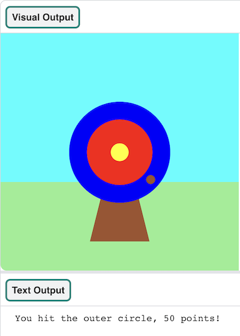

## Co budeš dělat

Použijte Python k nakreslení cíle a získejte body tím, že do něj zasáhnete šipkami.

--- print-only ---

{:width="640px"}

--- /print-only ---

--- no-print ---

  

Hru spustíte kliknutím na tlačítko **Spustit** níže. Když se tečka objeví na cíli 🎯, klikněte myší (nebo klepněte na tablet) a vystřelte šíp. 

  <iframe src="https://editor.raspberrypi.org/cs-CZ/embed/viewer/target-practice-solution" width="400" height="710" frameborder="0" marginwidth="0" marginheight="0" allowfullscreen>
  </iframe>

--- /no-print ---

  <a class="c-survey-banner__link" href="https://form.raspberrypi.org/f/code-editor-feedback" target="_blank">Zúčastněte se našeho průzkumu</a> a pomozte nám zlepšit náš editor kódu!

