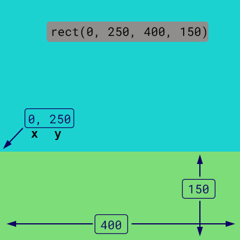
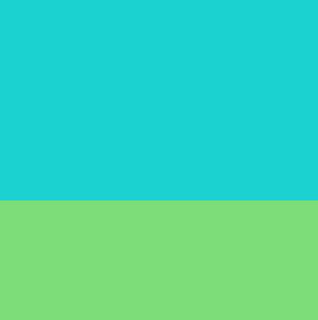

## Nakreslete trávu

--- task ---

Otevřete projekt [Target practice starter](https://editor.raspberrypi.org/en/projects/target-practice-starter){:target="_blank"}.

--- /task ---

--- task ---

**Přidejte kód** a nakreslete ve spodní části obrazovky zelený obdélník, který bude představovat trávu.

{:width="400px"}

--- code ---
---
language: python line_numbers: true line_number_start: 17
line_highlights: 21-22
---
def draw(): # Things to do in every frame fill('cyan')  
rect(0, 0, 400, 250)  
fill('lightgreen')  
rect(0, 250, 400, 150)

--- /code ---

--- /task ---

--- task ---

**Test:** Spusťte svůj projekt a zobrazte pozadí.

{:width="400px"}

--- /task ---

--- save ---
