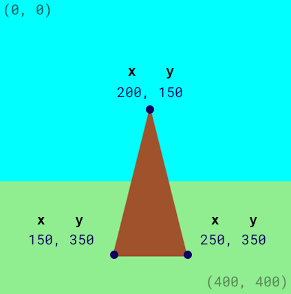
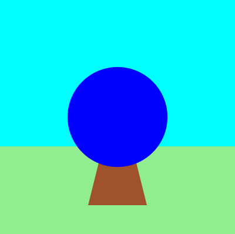

## Nakresli terč

Vaše hra potřebuje cíl, na který budete střílet šípy.

{:width="300px"}

### Nakresli trojúhelníkový stojan

--- task ---

Nastav barvu výplně na `brown`.

Nakresli trojúhelník pomocí souřadnic x a y pro každý z rohů.

{:width="400px"}

--- code ---
---
language: python
line_numbers: true
line_number_start: 21
line_highlights: 23-24
---
    fill('lightgreen')  
    rect(0, 250, 400, 150)  
    fill('brown') 
    triangle(150, 350, 200, 150, 250, 350)  

--- /code ---

--- /task ---

--- task ---

**Test:** Spusťte svůj kód, abyste viděli stojan pro svůj cíl:

{:width="400px"}

--- /task ---

### Nakresli kruhy terče

--- task ---

Největší část terče je modrý **kruh**.

Nastav barvu výplně na `blue`.

Nakresli kružnici se souřadnicemi x a y pro její střed a šířku.

{:width="400px"}

--- code ---
---
language: python
line_numbers: true
line_number_start: 23
line_highlights: 25-26
---
    fill('brown')  
    triangle(150, 350, 200, 150, 250, 350)  
    fill('blue')  
    circle(200, 200, 170)  
  
--- /code ---

--- /task ---

--- task ---

**Test:** Spusťte svůj kód a uvidíte první velký modrý kruh.

Modrý kruh byl nakreslen až když, byl nakreslen stojan, takže je vpředu.

{:width="400px"}

--- /task ---

Terč je vyroben z různě velkých kruhů se stejnými středovými souřadnicemi (200, 200).

--- task ---

**Přidejte** barevné kruhy pro vnitřní a střední části terče.

--- code ---
---
language: python
line_numbers: true
line_number_start: 25
line_highlights: 27-30
---

    fill('blue')  
    circle(200, 200, 170)  
    fill('red')  
    circle(200, 200, 110)  # Nakreslete vnitřní kruh
    fill('yellow')       
    circle(200, 200, 30)  # Nakreslete střední kruh

--- /code ---

--- /task ---

--- task ---

**Test:** Spusťte svůj projekt, abyste viděli cíl se třemi barevnými kruhy.

{:width="400px"}

--- /task ---

--- save ---
