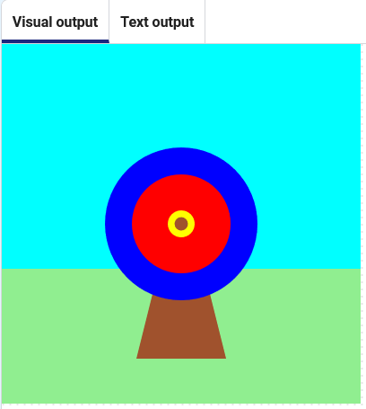

## Přidejte šíp

Přidejte ještě menší kruh, který bude představovat šíp.

{:width="300px"}

### Kam budeš střílet?

--- task ---

Přidej funkci pro nakreslení hnědého kruhu na souřadnicích `200`, `200`.

--- code ---
---
language: python line_numbers: true line_number_start: 8
line_highlights: 9-13
---
# The shoot_arrow function goes here
def shoot_arrow():   
arrow_x = 200 arrow_y = 200 fill('brown') circle(arrow_x, arrow_y, 15)

--- /code ---

--- /task ---

--- task ---

Na konci funkce `draw()`{:.language-python} zavolejte svou novou funkci `shoot_arrow()`{:.language-python}.

--- code ---
---
language: python line_numbers: true line_number_start: 33
line_highlights: 35
---

    fill('yellow')      
    circle(200, 200, 30)  
    shoot_arrow()

--- /code ---

--- /task ---

--- task ---

**Test:** Click the **Run** button. Měli byste vidět šíp uprostřed.

**Test:** Klikněte na tlačítko **Spustit**. Měli byste vidět šíp uprostřed.

--- /task ---

Šíp se musí pohybovat náhodně.

--- task ---

Změňte proměnné `arrow_x`{:.language-python} a `arrow_y`{:.language-python} a vyberte náhodné číslo mezi 100 a 300.

--- code ---
---
language: python line_numbers: true line_number_start: 9
line_highlights: 10-11
---
def shoot_arrow(): arrow_x = randint(100, 300) arrow_y = randint(100, 300) fill('brown') circle(arrow_x, arrow_y, 15)

--- /code ---

--- /task ---

--- task ---

**Test:** Klikněte na tlačítko **Spustit**. Měl bys vidět, jak šíp přeskakuje kolem cíle.

--- /task ---

--- save ---
