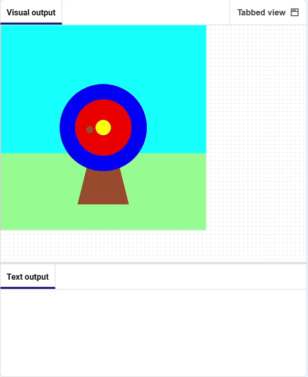

## Jakou barvu jsi trefil?

Dále přidej nějaký kód, ať získáš barvu v místě šípu.

### Získej barvu zasaženou šipkou

--- task ---

Přidej novou **globální proměnnou** s názvem `hit_color`.

Přidej část kódu, ať `získáte` barvu ve středu šipky a uložte ji do proměnné `hit_color` .

--- code ---
---
language: python line_numbers: true line_number_start: 9
line_highlights: 10, 13, 14
---
def shoot_arrow(): global hit_colour  
arrow_x = randint(100, 300)  
arrow_y = randint(100, 300) hit_colour = get(arrow_x, arrow_y).hex print(hit_colour) fill('brown') circle(arrow_x, arrow_y, 15)

--- /code ---

**Tip:** Kód pro `získání` barvy musí být **před kódem**, který kreslí kruh, jinak vždy uložíte hnědou barvu šípu!

--- /task ---

--- task ---

**Test:** Klikněte na tlačítko **Spustit**. Měli byste vidět barvy tištěné ve formátu **Textového výstupu**, v hexadecimálním formátu.

--- /task ---

### Spusť kód kliknutím myši

--- task ---

Zakomentujte řádek, který tiskne barvu. To znamená, že nepoběží.

--- code ---
---
language: python line_numbers: true line_number_start: 13
line_highlights: 14
---

    hit_colour = get(arrow_x, arrow_y).hex
    # print(hit_colour)
    circle(arrow_x, arrow_y, 15)

--- /code ---

--- /task ---

--- task ---

Přidej kód pro tisk cílového emoji 🎯 **po kliknutí myší**.

--- code ---
---
language: python line_numbers: true line_number_start: 5
line_highlights: 6-7
---
# The mouse_pressed function goes here
def mouse_pressed():    
print('🎯')

--- /code ---

--- /task ---

--- task ---

**Test:** Klikněte na tlačítko **Spustit**. Když klikneš myší na cíl, měl bys vidět vytištěný znak 🎯.

--- /task ---

--- save ---