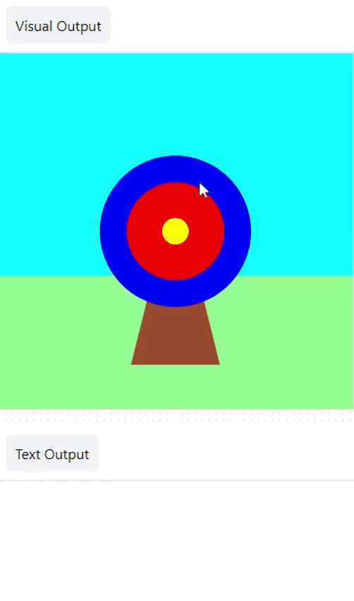
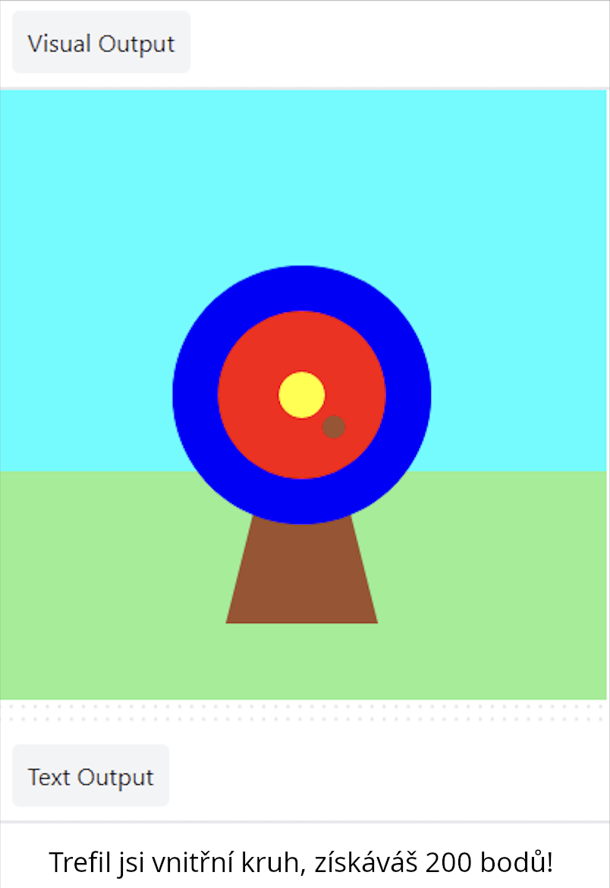

## Body

Přidej skóre podle toho, kam dopadne šíp.

{:width="300px"}

--- task ---

Zakomentuj řádek pro tisk znaku 🎯, aby již neběžel.

--- code ---
---
language: python line_numbers: true line_number_start: 6
line_highlights: 7
---
def mouse_pressed(): # print('🎯')

--- /code ---

--- /task ---

--- task ---

Zobrazte zprávu **if** `hit_color`{:.language-python} se rovná `barvě vnějšího` kruhu (modrá).

--- code ---
---
language: python line_numbers: true line_number_start: 6
line_highlights: 8-9
---
def mouse_pressed():    
# print('🎯') if hit_colour == Color('blue').hex: print('You hit the outer circle, 50 points!')

--- /code ---

**Tip:** Pokud jsi změnil barvu vnějšího kruhu, budeš muset nahradit `modrou` názvem barvy, kterou jsi vybral.

--- /task ---

--- task ---

**Test:** Klikni na tlačítko **Spustit**. Počkejte, až šíp přistane na modrém kruhu, a poté klikni levým tlačítkem myši. 

--- /task ---

`elif`{:.language-python} lze použít k přidání dalších podmínek k tvému `if`{:.language-python}.

--- task ---

Přidejte další kód, abyste získali body, pokud šíp dopadne na **vnitřní** nebo **prostřední** kruhy.

--- code ---
---
language: python line_numbers: true line_number_start: 6
line_highlights: 10-14
---

def mouse_pressed(): # print('🎯') if hit_colour == Color('blue').hex: print('You hit the outer circle, 50 points!') elif hit_colour == Color('red').hex: print('You hit the inner circle, 200 points!') elif hit_colour == Color('yellow').hex: print('You hit the middle, 500 points!')

--- /code ---

--- /task ---

--- task ---

**Test:** Klikněte na tlačítko **Spustit**. Kdykoli zasáhneš cíl, měli byste získat body.

--- /task ---

### Vedle

Musíte udělat ještě jedno rozhodnutí: co se stane, když šíp nedopadne na žádný z cílových kruhů?

K provedení této poslední kontroly použijte `else`{:.language-python}.

--- task ---

Přidejte kód do `print` zprávu, když žádný z `, pokud` a `elif` není pravdivý.

--- code ---
---
language: python line_numbers: true line_number_start: 12
line_highlights: 14-15
---

    elif hit_colour == Color('yellow').hex:
        print('You hit the middle, 500 points!')
    else:   
        print('You missed! No points!')

--- /code ---

--- /task ---

--- task ---

**Test:** Klikněte na tlačítko **Spustit**. Vystřelte šíp do trávy nebo na oblohu, abyste viděli zprávu o chybě.

--- /task ---

--- save ---
