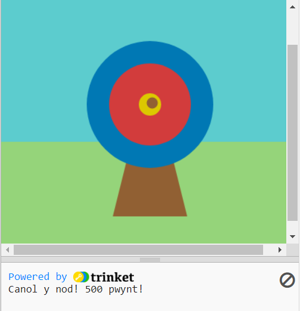

## You will make

Defnyddiwch Python, a'r llyfrgell graffeg `p5`, i lunio targed a sgorio pwyntiau drwy ei daro â saethau.

Byddi di'n:
 + Personoli eich gêm gyda **lliwiau RGB**
 + Defnyddio **datganiadau amodol** (`if`, `elif`, `else`) i wneud penderfyniadau
 + Lleoli siapiau gyda **chyfesurynnau x, y**

--- no-print ---

### Play ▶️

--- task ---

  
Cliciwch y botwm **Run** isod i ddechrau'r gêm. When the dot appears on the target 🎯, click the mouse (or tap on your tablet) to fire your arrow. 

Rhowch ambell gynnig arni. Bydd eich sgôr yn ymddangos yn yr ardal allbwn o dan y targed. Sut mae eich sgôr yn newid pan fydd y saeth yn glanio ar y gwahanol liwiau? 
  <iframe src="https://trinket.io/embed/python/f686c82d8a?outputOnly=true" width="600" height="560" frameborder="0" marginwidth="0" marginheight="0" allowfullscreen>
  </iframe>

--- /task ---

--- /no-print ---

--- print-only ---

--- /print-only ---

The oldest evidence of  archery  comes from the Sibudu Cave in KwaZulu-Natal, South Africa. Remains of stone and bone arrowheads have been found, which date to between 60,000 and 70,000 years ago. 

