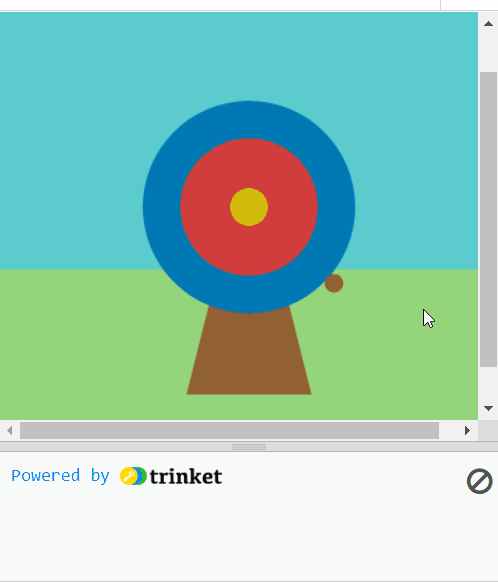
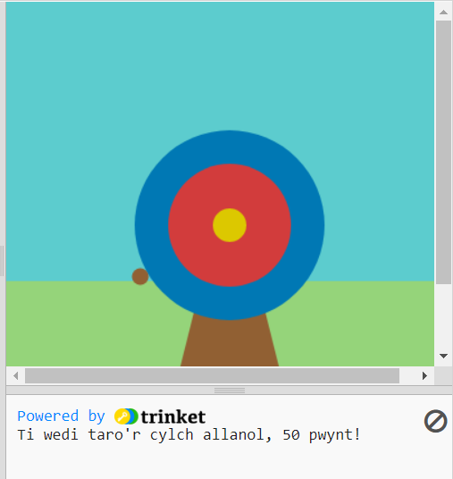
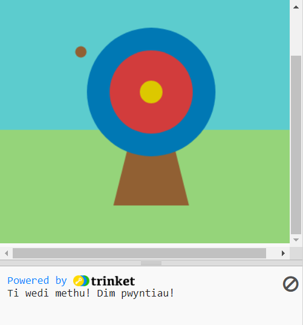

## Sgorio pwyntiau

Yn y cam hwn, byddwch chi'n ychwanegu sgoriau ar sail lle mae'r saeth yn taro.

{:width="300px"}

--- task ---

Bydd y newidynnau lliw yn y swyddogaeth `draw()` yn cael eu defnyddio i wirio'r sgôr yn y swyddogaeth `mouse_pressed()`. I wneud hyn, bydd angen eu gosod fel newidynnau cyffredinol:

--- code ---
---
language: python filename: main.py line_numbers: true line_number_start: 26
line_highlights: 28
---

def draw():
# Pethau i'w gwneud ym mhob ffrâm
  global allanol, mewnol, canol_y_nod    
awyr = color(92, 204, 206) #Coch = 92, Gwyrdd = 204, Glas = 206    
gwair = color(149, 212, 122)    
pren = color(145, 96, 51)    
allanol = color(0, 120, 180)    
mewnol = color(210, 60, 60)   
canol_y_nod = color(220, 200, 0)

--- /code ---

--- /task ---

Rydyn ni'n defnyddio amodau i wneud penderfyniadau drwy'r amser. Pethau fel 'os nad oes min ar y pensil, mae angen ei finio'. Similarly, `if` conditions let us write code that do something different depending on whether a condition is true or false.

### Display the scores

--- task ---

I brintio neges ar gyfer cylch allanol y targed, ychwanegwch god at eich swyddogaeth `mouse_pressed()` i wneud yn siŵr bod y `lliw_taro` `==` to `allanol`.

--- code ---
---
Newidiwch y cod yn eich `print()` i roi sgôr:
line_highlights: 10-11
---
# Mae'r swyddogaeth mouse_pressed yn mynd fan hyn
def mouse_pressed():

--- /code ---

--- /task ---

--- task ---

`print` a message `if` the `hit_color` is equal to `outer` 🎯.

Notice 👀 that the code uses two equals signs `==` to mean **equal to**.

--- code ---
---
**Cyngor:** Mae `frame_rate()` yn `setup()` yn rheoli pa mor gyflym mae eich gêm yn llunio. Os yw'n mynd yn rhy gyflym, rhowch rif is.
line_highlights: 12-15
---

# The mouse_pressed function goes here
def mouse_pressed():     
if hit_color == outer:      
print('You hit the outer circle, 50 points!') # Like functions, 'if' statements are indented

--- /code ---

--- /task ---

--- task ---

**Test:** 🔄 Run your project. Try to stop the arrow on the blue outer circle to see your message.

**Tip:** 💡 `frame_rate()`, in `setup`, controls how fast your game draws. If it's going too fast, set it to a lower number.

Yr hyn sy'n gwneud `elif` yn wahanol yw y bydd yn gwirio dim ond os yw amodau `if` ac unrhyw `elif` o'i flaen yn `False`.

--- /task ---

`elif` (else - if) can be used to add more conditions to your `if` statement. These will be read from top to bottom. As soon as a **True** condition is found, it will be actioned. The remaining conditions will be ignored.

--- task ---

def mouse_pressed():    
if lliw_taro == allanol:    
print('Ti wedi taro'r cylch allanol, 50 pwynt!')    
elif lliw_taro == mewnol:    
print('Ti wedi taro'r cylch mewnol, 200 pwynt!')   
elif lliw_taro == canol_y_nod:    
print('Canol y nod! 500 pwynt!')

--- code ---
---
language: python filename: main.py - mouse_pressed() line_numbers: true line_number_start: 8
line_highlights: 16-17
---

def mouse_pressed():    
if hit_color == outer:    
print('You hit the outer circle, 50 points!')    
elif hit_color == inner:    
print('You hit the inner circle, 200 points!')   
elif hit_color == middle:    
print('You hit the middle, 500 points!')

--- /code ---

--- /task ---

--- task ---

**Test:** 🔄 Run your project. Try to stop the arrow on the inner and middle circles to see their messages.

Mae un penderfyniad arall i chi ei wneud: beth sy'n digwydd os nad yw'r saeth yn glanio ar unrhyw un o gylchoedd y targed? Rydych chi'n defnyddio `else` i wneud y gwiriad olaf hwn.

Rydyn ni'n defnyddio  os (if) … fel arall (else)  i wneud penderfyniadau. Pan fyddwch chi'n deffro, rydych chi'n gweld a yw hi'n fore ac os felly, yn deffro. Fel arall, rydych chi'n mynd yn ôl i gysgu. Allwch chi feddwl am unrhyw benderfyniadau os ... fel arall rydych chi'n eu gwneud?

--- /task ---

### Missing the target

There is one more decision you need to make: what happens if the arrow does not land on any of the target circles? ❌

To do this last check, you use `else`.

--- task ---

def mouse_pressed():    
if lliw_taro == allanol:   
print('Ti wedi taro'r cylch allanol, 50 pwynt!')   
elif lliw_taro == mewnol:   
print('Ti wedi taro'r cylch mewnol, 200 pwynt!')   
elif lliw_taro == canol_y_nod:    
print('Canol y nod! 500 pwynt!')   
else:   
print('Ti wedi methu! Dim pwyntiau!')

--- code ---
---
language: python filename: main.py line_numbers: true line_number_start: 8
line_highlights: 15, 16
---

def mouse_pressed():    
if hit_color == outer:   
print('You hit the outer circle, 50 points!')   
elif hit_color == inner:   
print('You hit the inner circle, 200 points!')   
elif hit_color == middle:    
print('You hit the middle, 500 points!')   
else:   
print('You missed! No points!')

--- /code ---

--- /task ---

--- task ---

**Test:** 🔄 Run your project. Try to stop the arrow in the grass or sky to see the miss message.

**Choose:** 💭 Change the number of points scored for the different colours if you like.

--- /task ---

