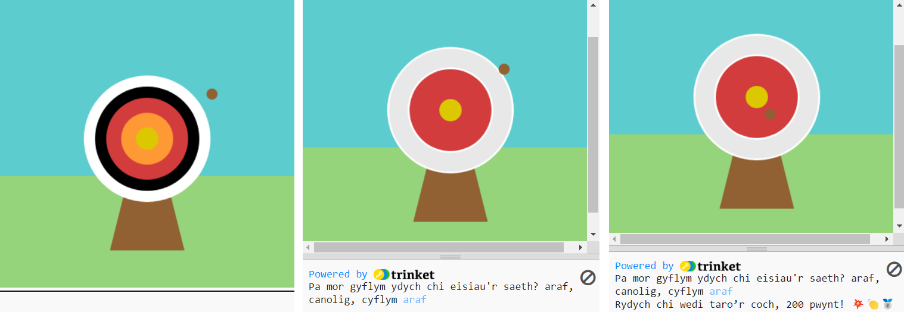

## Uwchraddio eich prosiect

Fe allwch chi bersonoli eich prosiect ac ychwanegu ato. Fe allech chi ei wneud yn anoddach, neu ychwanegu fwy o gylchoedd at eich targed.

{:width="300px"}

--- task ---

Fe allech chi:

+ Ychwanegu `pedwerydd` a `phumed` cylch, mewn lliwiau newydd, sy'n sgorio nifer gwahanol o bwyntiau ar sail eu lleoliad
+ Rhoi emoji yn eich negeseuon print ([dyma restr o emoji](https://unicode.org/emoji/charts/full-emoji-list.html){:target="_blank"} i chi gopio ohoni)
+ Gwneud y gêm yn haws neu'n anoddach drwy newid y gwerth `frame_rate(2)`
+ Defnyddio `input()` i ofyn i'r defnyddiwr pa mor anodd mae'n dymuno i'r gêm fod

--- /task ---

--- collapse ---
---
title: Prosiect gorffenedig
---

Fe allwch chi weld y [prosiect gorffenedig yma](https://trinket.io/python/5126c55555){:target="_blank"}.

--- /collapse ---

--- save ---
