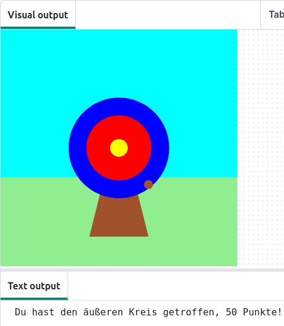

  <a class="c-survey-banner__link" href="https://form.raspberrypi.org/f/code-editor-feedback" target="_blank">Nimm an unserer Umfrage teil</a>, um unseren Code Editor zu verbessern!

## Das wirst Du machen

Verwende Python mit der Grafikbibliothek `p5`, um eine Zielscheibe zu zeichnen, und Punkte zu erzielen, indem Du sie mit Pfeilen triffst.

Du wirst:
 + Dein Spiel mit **RGB-Farben** personalisieren
 + **Bedingte Anweisungen** (`if`, `elif`, `else`) benutzen, um Entscheidungen zu treffen
 + Formen mit **x-, y-Koordinaten** positionieren

--- no-print ---

### Abspielen

--- task ---

  

Klicke unten auf die Schaltfläche **Ausführen**, um das Spiel zu starten. Wenn der Punkt auf der Zielscheibe 🎯 erscheint, klicke mit der Maus (oder tippe auf deinem Tablet), um deinen Pfeil abzufeuern. 

Mach ein paar Versuche. Dein Punktestand erscheint im Ausgabebereich unterhalb der Zielscheibe. Wie verändert sich deine Punktzahl, wenn der Pfeil auf den verschiedenen Farben landet? 
  <iframe src="https://editor.raspberrypi.org/de-DE/embed/viewer/target-practice-solution" width="400" height="710" frameborder="0" marginwidth="0" marginheight="0" allowfullscreen>
  </iframe>

**Tipp:** 💡 Wenn du **Stopp** drückst, wird eine Ausgabe mit der Meldung „Execution interrupted“ (deutsch: „Ausführung unterbrochen“) angezeigt. Dies bedeutet lediglich, dass du das Programm gestoppt hast, während der Code noch ausgeführt wurde.

--- /task ---

--- /no-print ---

--- print-only ---

{:width="640px"}

--- /print-only ---

Der älteste Nachweis auf  Bogenschießen  stammt aus der Sibudu-Höhle in KwaZulu-Natal, Südafrika. Es wurden Überreste von Pfeilspitzen aus Stein und Knochen gefunden, die zwischen 60.000 und 70.000 Jahre alt sind. 

