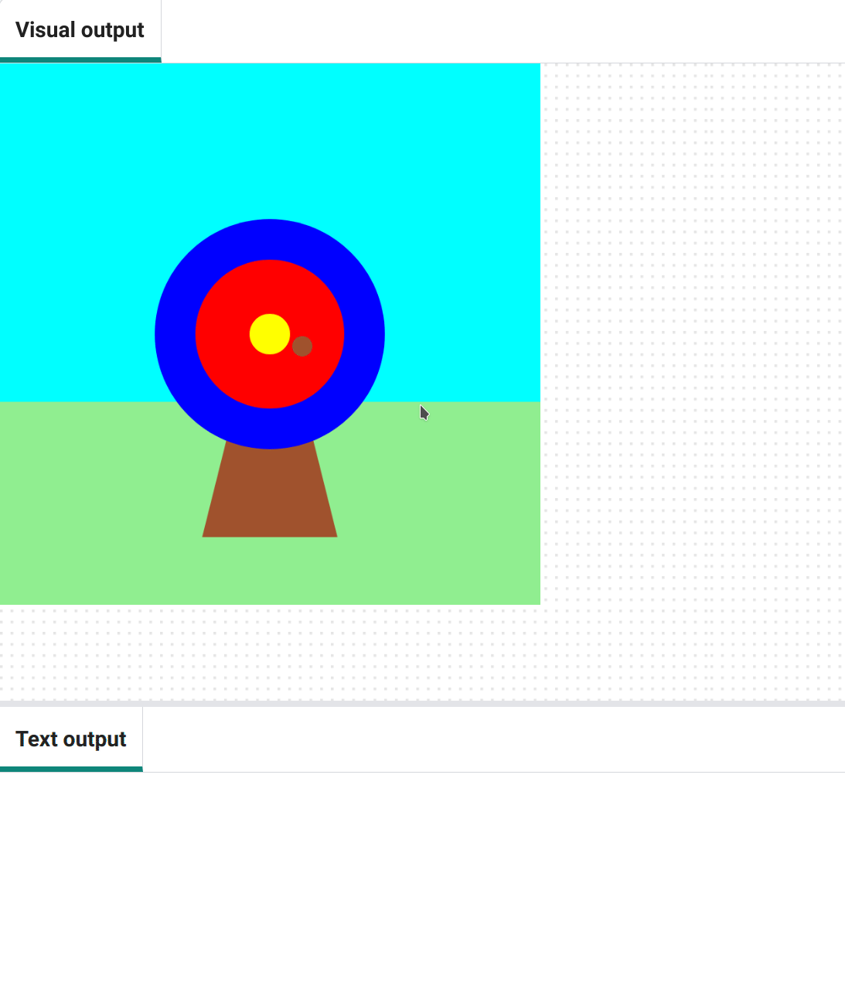
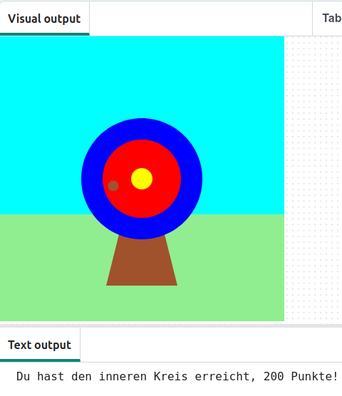

## Punkten

Dein Spiel vergibt Punkte je nachdem, wo der Pfeil auftrifft.

{:width="300px"}

Wir verwenden ständig  Bedingungen, um Entscheidungen zu treffen. Wir könnten sagen: „Wenn der Bleistift stumpf ist, dann spitzt Du ihn“. In ähnlicher Weise können wir mit „if“-Bedingungen (deutsch „Wenn“) Code schreiben, der etwas anderes tut, je nachdem, ob eine Bedingung wahr oder falsch ist.

### Punkte anzeigen

--- task ---

Lösche ❌ die Codezeile `print('🎯')`.

--- code ---
---
language: python filename: main.py line_numbers: true line_number_start: 5
line_highlights: 7
---
# Die Funktion „mouse_pressed“ kommt hierher
def mouse_pressed():

--- /code ---

--- /task ---

--- task ---

Zeigt eine Meldung **wenn** die `getroffene_farbe` gleich der `äußeren` Kreisfarbe (blue, deutsch: blau) ist 🎯.

Beachte 👀, dass im Code zwei Gleichheitszeichen `==` verwendet werden, um **gleich** zu bedeuten.

--- code ---
---
language: python filename: main.py - mouse_pressed() line_numbers: true line_number_start: 5
line_highlights: 7, 8
---

# Die Funktion „mouse_pressed“ kommt hierher
def mouse_pressed():     
if hit_colour == Color('blue').hex:  # Like the code in functions, the code in 'if' statements is indented print('You hit the outer circle, 50 points!')

--- /code ---

**Tipp:** 💡 Wenn du die Farbe deines äußeren Kreises geändert hast, musst du `„blue“` durch den von dir gewählten Farbnamen ersetzen.

--- /task ---

--- task ---

**Test:** 🔄 Führe dein Projekt aus. Versuche, den Pfeil auf den blauen äußeren Kreis abzufeuern, um die Ausgabe zu sehen.

**Tipp:** 💡 Mit dem Argument `frame_rate=2` (deutsch: Einzelbildrate), in `run` am Ende deines Codes kannst du steuern, wie schnell das Spiel die Bilder zeichnet. Wenn es zu schnell geht, stell eine niedrigere Zahl ein.

**Debug:** 🐞 Stelle sicher, dass dein Code genau übereinstimmt und dass du den Code innerhalb deiner `if` -Anweisung eingerückt hast.

**Debug:** 🐞 Stelle sicher, dass du den richtigen Farbnamen eingegeben hast, den du für **deinen** äußeren Kreis verwendet hast.

--- /task ---

`elif` (kurz für else - if, deutsch: sonst - wenn) kann verwendet werden, um deiner `if`-Anweisung weitere Bedingungen hinzuzufügen. Diese werden von oben nach unten gelesen. Sobald eine **wahre**-Bedingung gefunden wird, wird der entsprechende eingerückte Code darunter ausgeführt. Alle verbleibenden Bedingungen werden ignoriert.

--- task ---

Erziele Punkte, wenn der Pfeil auf den `inneren` oder `mittleren` Kreisen landet 🎯:

--- code ---
---
language: python filename: main.py - mouse_pressed() line_numbers: true line_number_start: 6
line_highlights: 9-12
---

def mouse_pressed(): if hit_colour == Color('blue').hex:   
print('You hit the outer circle, 50 points!') elif hit_colour == Color('red').hex: print('You hit the inner circle, 200 points!') elif hit_colour == Color('yellow').hex: print('You hit the middle, 500 points!')

--- /code ---

--- /task ---

--- task ---

**Test:** 🔄 Führe dein Projekt aus. Versuche, den Pfeil auf den inneren und den mittleren Kreis abzufeuern, um die jeweiligen Ausgaben zu sehen.

**Debug:** 🐞 Überprüfe, ob deine Einrückungen mit dem Beispiel übereinstimmt.

**Debug:** 🐞 Wenn du eine Meldung siehst, dass `getroffene_farbe` „not defined“ (deutsch: „nicht definiert“) ist, gehe zurück zu `draw()` und überprüfe, ob die Zeile `getroffene_farbe` als eine globale Variable deklariert.

**Debug:** 🐞 Stelle sicher, dass du den richtigen Farbnamen eingegeben hast, die du für **deine** Kreise verwendet hast.

**Debug:** 🐞 Stelle sicher, dass du die `.hex`-Zeichenfolge für **deine** Kreisfarben verwendet hast.

--- /task ---

### Das Ziel verfehlen

Du musst noch eine weitere Entscheidung treffen: Was passiert, wenn der Pfeil auf keinem der Zielkreise landet? ❌

Um diese letzte Bedingung zu überprüfen, verwendest du `else` (deutsch: sonst).

--- task ---

Füge Code für eine `print`-Asugabe hinzu, wenn `else (sonst)` keine der Bedingungen von `if` und `elif` erfüllt werden.

--- code ---
---
language: python filename: main.py line_numbers: true line_number_start: 6
line_highlights: 13-14
---

def mouse_pressed(): if hit_colour == Color('blue').hex:   
print('You hit the outer circle, 50 points!') elif hit_colour == Color('red').hex: print('You hit the inner circle, 200 points!') elif hit_colour == Color('yellow').hex: print('You hit the middle, 500 points!') else:   
print('You missed! No points!')

--- /code ---

--- /task ---

--- task ---

**Test:** 🔄 Führe dein Projekt aus. Schieß den Pfeil ins Gras oder in den Himmel, um die Verfehlt-Ausgabe zu sehen.

**Wählen aus:** 💭 Ändere die Anzahl der Punkte, die für die verschiedenen Farben erzielt werden.

--- /task ---

--- save ---
