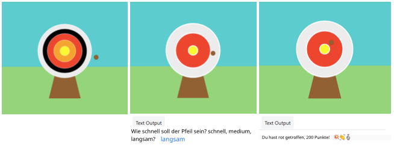

## Verbessere Dein Projekt

Personalisiere dein Projekt und füge mehr hinzu. Vielleicht könntest du den Schwierigkeitsgrad ändern oder deiner Zielscheibe weitere Kreise hinzufügen.

{:width="300px"}

--- task ---

Du könntest:

+ Einen `vierten` und einen `fünften` Kreis in neuen Farben hinzufügen, die je nach Position unterschiedliche Punkte erzielen 🟠🟣
+ Emojis in deine Ausgaben einbauen ([hier ist eine Liste von Emojis](https://unicode.org/emoji/charts/full-emoji-list.html){:target="_blank"} zum Kopieren) 🎯
+ Das Spiel einfacher oder schwieriger machen, indem du den Wert `frame_rate=2` änderst 💨
+ `input()` verwenden, um vor dem Spiel nach dem Schwierigkeitsgrad zu fragen 🗣️

--- /task ---

--- collapse ---
---
title: Abgeschlossenes Projekt
---

Du findest das [abgeschlossene Projekt hier](https://editor.raspberrypi.org/de-DE/projects/target-practice-solution){:target="_blank"}.

--- /collapse ---
