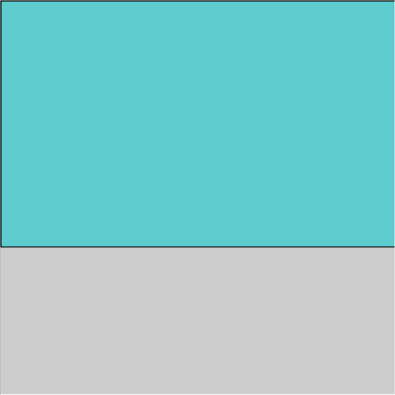

## Δημιούργησε ένα υπόβαθρο

Ο ουρανός και το γρασίδι φτιάχνονται γράφοντας κώδικα για να σχεδιάσεις χρωματιστά ορθογώνια.

{:width="300px"}

--- task ---

Άνοιξε το [αρχικό έργο Τοξοβολίας](https://trinket.io/python/1e11252c65){:target="_blank"}.

Εάν έχεις λογαριασμό Trinket, μπορείς να κάνεις κλικ στο κουμπί **Remix** για να αποθηκεύσεις ένα αντίγραφο στη βιβλιοθήκη `My Trinkets`.

--- /task ---

Το αρχικό έργο έχει ήδη έτοιμο κώδικα για να εισαγάγεις τη βιβλιοθήκη `p5`, θα χρησιμοποιήσεις αυτήν τη βιβλιοθήκη για να δημιουργήσεις το παιχνίδι τοξοβολίας σου.

[[[p5-processing-library]]]

--- task ---

Η συνάρτηση `fill()` ορίζει το εσωτερικό χρώμα των σχημάτων. Το αρχικό έργο περιέχει ήδη μερικά χρώματα RGB που μπορείς να χρησιμοποιήσεις για να το κάνεις αυτό.

Βρες τη συνάρτηση `draw()` και ετοιμάσου να σχεδιάσεις τον ουρανό προσθέτοντας κώδικα σε εσοχή για να ορίσεις τη μεταβλητή `sky` ως το χρώμα της `fill()`:

--- code ---
---
language: python 
filename: main.py — draw() 
line_numbers: true 
line_number_start: 18
line_highlights: 25
---

def draw():     
  #Πράγματα που θα συμβαίνουν σε κάθε καρέ     
  sky = color(92, 204, 206) #Κόκκινο = 92, Πράσινο = 204, Μπλε = 206     
  grass = color(149, 212, 122)     
  wood = color(145, 96, 51)     
  outer = color(0, 120, 180)

  fill(sky)

--- /code ---

--- /task ---

Η κλήση της συνάρτησης `size()` στο `setup()` ορίζει το μέγεθος της οθόνης σε 400 pixel επί 400 pixel.

[[[p5-coordinates]]]

--- task ---

Μετά τον κώδικα της `fill()`, σχεδίασε ένα `rect()` (ορθογώνιο) για τον ουρανό με συντεταγμένες πάνω αριστερά (`0`,`0`), πλάτος `400` για να ταιριάζει με το πλάτος της οθόνης και ύψος `250`.

--- code ---
---
language: python 
filename: main.py — draw() 
line_numbers: true 
line_number_start: 25
line_highlights: 26
---

  fill(sky) 
  rect(0, 0, 400, 250) #Αρχή x, αρχή y, πλάτος, ύψος

--- /code ---

--- /task ---

--- task ---

**Δοκιμή:** Εκτέλεσε τον κώδικά σου για να δεις τον ουρανό που ζωγράφισες. Θυμήσου ότι με τη βιβλιοθήκη `p5`, η συνάρτηση `run()` καλεί τη συνάρτηση `setup()` μία φορά και μετά τη συνάρτηση `draw()` επανειλημμένα.

{:width="300px"}

Αυτό είναι λίγο περίεργο: υπάρχει μια μαύρη γραμμή γύρω από τον ουρανό σου! Αυτό συμβαίνει επειδή, όταν ξεκινά το πρόγραμμα, θέτει αυτόματα ένα μαύρο περίγραμμα — που ονομάζεται **stroke** — γύρω από όλα όσα σχεδιάζει.

--- /task ---

--- task ---

Απενεργοποίησε το stroke προσθέτοντας `no_stroke()` πριν ξεκινήσεις να σχεδιάζεις τον ουρανό.

--- code ---
---
language: python 
filename: main.py — draw() 
line_numbers: true 
line_number_start: 23
line_highlights: 25
---

  outer = color(0, 120, 180)

  no_stroke()   
  fill(sky)   
  rect(0, 0, 400, 250) #x, y, πλάτος, ύψος

--- /code ---

--- /task ---

--- task ---

**Δοκιμή:** Τρέξε το έργο σου ξανά για να διαπιστώσεις ότι το περίγραμμα έχει φύγει.

--- /task ---

--- task ---

Η συνάρτηση `fill()` αλλάζει το χρώμα γεμίσματος για όλα τα σχήματα που σχεδιάζονται έως ότου γίνει ξανά κλήση της `fill()` με νέο χρώμα.

Άλλαξε το χρώμα της `fill()` σε `grass` και πρόσθεσε ακόμη ένα `rect(x, y, πλάτος, ύψος)`.

Αυτό το ορθογώνιο πρέπει να τοποθετηθεί κάτω από τον ουρανό σε συντεταγμένες (0, 250), έτσι ώστε να ξεκινά από το κάτω μέρος της οθόνης.

--- code ---
---
language: python 
filename: main.py — draw() 
line_numbers: true 
line_number_start: 23
line_highlights: 28-29
---

  outer = color(0, 120, 180)

  no_stroke()     
  fill(sky)     
  rect(0, 0, 400, 250) #x, y, πλάτος, ύψος    
  fill(grass)    
  rect(0, 250, 400, 150)

--- /code ---

--- /task ---

--- task ---

**Δοκιμή:** Τρέξε το έργο σου ξανά για να δεις το ολοκληρωμένο υπόβαθρο.

--- /task ---

--- save ---
