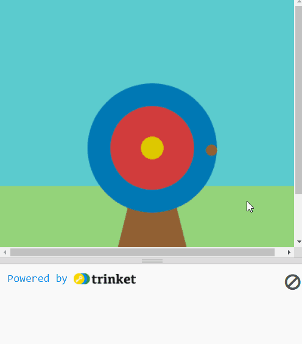
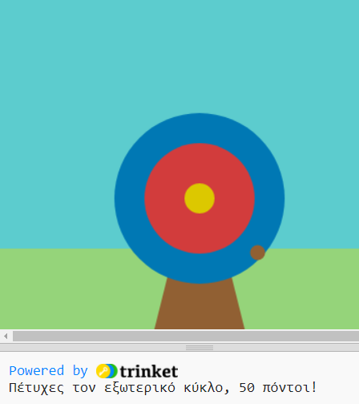
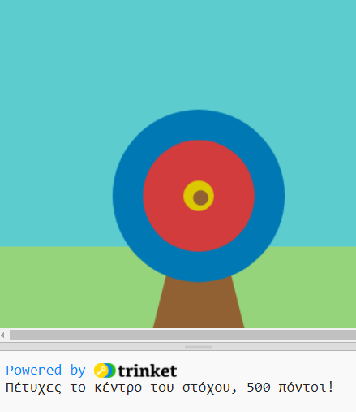
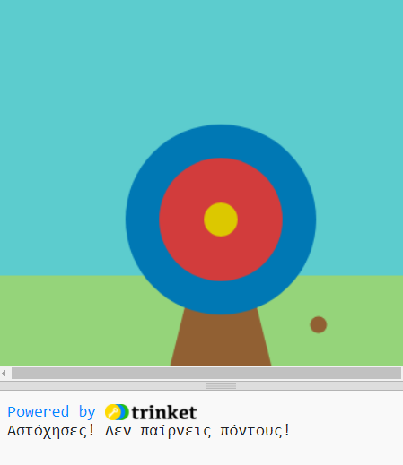

## Κέρδισε πόντους

Σε αυτό το βήμα, θα προσθέσεις πόντους ανάλογα με το σημείο που χτυπάει το βέλος.

{:width="300px"}

--- task ---

Go to the `draw()` function and add `, outer, inner, middle` to the list of global variables.

--- code ---
---
language: python filename: main.py line_numbers: true line_number_start: 26
line_highlights: 28
---

def draw():
# Ενέργειες που πρέπει να γίνονται σε κάθε καρέ
  global outer, inner, bullseye    
sky = color(92, 204, 206) #Κόκκινο = 92, Πράσινο = 204, Μπλε = 206    
grass = color(149, 212, 122)    
wood = color(145, 96, 51)    
outer = color(0, 120, 180)    
inner = color(210, 60, 60)   
bullseye = color(220, 200, 0)

--- /code ---

--- /task ---

Χρησιμοποιούμε συνθήκες όλη την ώρα για να λάβουμε αποφάσεις. Θα μπορούσαμε να πούμε «αν το μολύβι δεν είναι μυτερό, τότε πρέπει να το ξύσεις». Similarly, `if` conditions let us write code that do something different depending on whether a condition is true or false.

### Display the scores

--- task ---

Για να `εμφανίσεις` μήνυμα για τον εξωτερικό κύκλο του στόχου, πρόσθεσε κώδικα στη συνάρτηση `mouse_pressed()` για να ελέγξεις εάν το `hit_color` είναι `==` με το `outer`.

--- code ---
---
Άλλαξε τον κώδικα στο `print()` για να εμφανίσει τη βαθμολογία:
line_highlights: 10-11
---
# Η συνάρτηση mouse_pressed πηγαίνει εδώ
def mouse_pressed():

--- /code ---

--- /task ---

--- task ---

`print` a message `if` the `hit_color` is equal to `outer` 🎯.

Notice 👀 that the code uses two equals signs `==` to mean **equal to**.

--- code ---
---
language: python filename: main.py - mouse_pressed() line_numbers: true line_number_start: 7
line_highlights: 12-15
---

# The mouse_pressed function goes here
def mouse_pressed():     
if hit_color == outer:      
print('You hit the outer circle, 50 points!') # Like functions, 'if' statements are indented

--- /code ---

--- /task ---

--- task ---

**Test:** 🔄 Run your project. Try to stop the arrow on the blue outer circle to see your message.

**Tip:** 💡 `frame_rate()`, in `setup`, controls how fast your game draws. If it's going too fast, set it to a lower number.

Αυτό που κάνει το `elif` διαφορετικό είναι ότι θα κάνει αυτόν τον έλεγχο μόνο εάν οι συνθήκες του `if` και οποιωνδήποτε `elif` πριν από αυτό είναι `Ψευδείς`.

--- /task ---

`elif` (else - if) can be used to add more conditions to your `if` statement. These will be read from top to bottom. As soon as a **True** condition is found, it will be actioned. The remaining conditions will be ignored.

--- task ---

def mouse_pressed():    
if hit_color == outer:    
print('Χτύπησες τον εξωτερικό κύκλο, 50 πόντοι!')    
elif hit_color == inner:    
print('Χτύπησες τον εσωτερικό κύκλο, 200 πόντοι!')   
elif hit_color == bullseye:    
print('Χτύπησες το κέντρο του στόχου, 500 πόντοι!')

--- code ---
---
language: python filename: main.py - mouse_pressed() line_numbers: true line_number_start: 8
line_highlights: 16-17
---

def mouse_pressed():    
if hit_color == outer:    
print('You hit the outer circle, 50 points!')    
elif hit_color == inner:    
print('You hit the inner circle, 200 points!')   
elif hit_color == middle:    
print('You hit the middle, 500 points!')

--- /code ---

--- /task ---

--- task ---

**Test:** 🔄 Run your project. Try to stop the arrow on the inner and middle circles to see their messages.

**Debug:** 🐞 Check your indentation matches the example.

**Debug:** 🐞 If you see a message about `inner` or `middle` being 'not defined', then go back to `draw()` and check that they are on the line that declares variables global.

--- /task ---

### Missing the target

There is one more decision you need to make: what happens if the arrow does not land on any of the target circles? ❌

To do this last check, you use `else`.

--- task ---

Add code to `print` a message `else` none of the `if` and `elif` statements have been met.

--- code ---
---
language: python filename: main.py line_numbers: true line_number_start: 8
line_highlights: 15, 16
---

def mouse_pressed():    
if hit_color == outer:   
print('You hit the outer circle, 50 points!')   
elif hit_color == inner:   
print('You hit the inner circle, 200 points!')   
elif hit_color == middle:    
print('You hit the middle, 500 points!')   
else:   
print('You missed! No points!')

--- /code ---

--- /task ---

--- task ---

**Test:** 🔄 Run your project. Try to stop the arrow in the grass or sky to see the miss message.

**Choose:** 💭 Change the number of points scored for the different colours if you like.

--- /task ---

