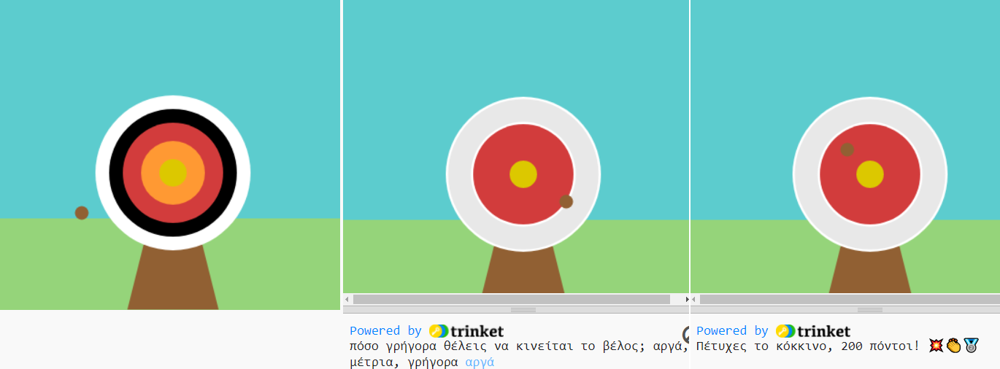

## Αναβάθμισε το έργο σου

Κάνε τις δικές σου επιλογές και πρόσθεσε περισσότερα στο έργο σου. Ίσως θα μπορούσες να αλλάξεις το επίπεδο δυσκολίας ή να προσθέσεις περισσότερους κύκλους στον στόχο σου.

{:width="300px"}

--- task ---

Θα μπορούσες να:

+ Προσθέσεις έναν `τέταρτο` και `πέμπτο` κύκλο, με νέα χρώματα, που δίνουν διαφορετικούς πόντους με βάση τη θέση τους
+ Τοποθετήσεις emoji στα μηνύματα που εμφανίζονται ([εδώ είναι μια λίστα με emoji](https://unicode.org/emoji/charts/full-emoji-list.html){:target="_blank"} από την οποία μπορείς να αντιγράψεις)
+ Κάνεις το παιχνίδι ευκολότερο ή δυσκολότερο αλλάζοντας την τιμή `frame_rate(2)`
+ Χρησιμοποιήσεις το `input()` για να ρωτήσεις τον χρήστη σε ποιο επίπεδο δυσκολίας θέλει να παίξει

--- /task ---

--- collapse ---
---
title: Ολοκληρωμένο έργο
---

Μπορείς να δεις [ολοκληρωμένο το έργο εδώ](https://trinket.io/python/f686c82d8a){:target="_blank"}.

--- /collapse ---

--- save ---
