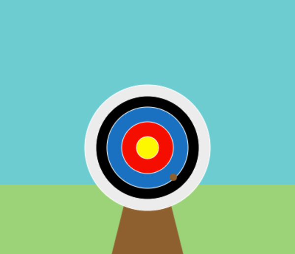

## Introduction

In this project, you will use python to create an archery game by drawing a target and shoot arrows as close to the bullseye as you can. 

The term  Bullseye when used to mean the centre of a target may have come from the practice of English archers who, both to develop and to exhibit their skills, would attempt to shoot an arrow through the eye socket of a bull's skull.

In Japanese archery, known as Kyūdō, the bullseye is called zuboshi. The term is also used just as it is in English; to show that someone has done or said something that is "exactly right."

You will:
+ Code and draw simple coloured shapes using python
+ Use conditional statements (if, else if, else) to simulate decision making
+ Create functions to organise code 

--- no-print ---
--- task ---
### Try it

  
Click **Run** in the python Trinket below to start the game. Once the program is running, you will see a small dot appearing randomly in the display window. 

When the dot appears close to the centre of the target, click the mouse to fire your arrow and see how many points you get!

  <iframe src="https://trinket.io/embed/python/6a22c68892" width="100%" height="356" frameborder="0" marginwidth="0" marginheight="0" allowfullscreen></iframe>

--- /task ---
--- /no-print ---

--- print-only ---

--- /print-only ---
