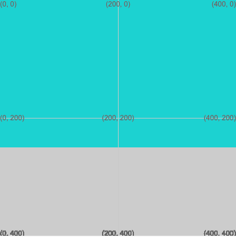

## Create a game world

In this step you will create the background for your game.

{:width="300px"}

--- task ---

Open the [Python archery starter](https://trinket.io/python/bbcc44911d) project. Click on the remix button.

<mark>Offline Python ingredient goes here. Do we show them manual online saving?</mark>

--- save ---

--- /task ---

The first step in making your game is to draw the sky and grass background. The starter already contains some colours you can use to do this.

--- task ---

Inside your `draw()` function, add code to set the `fill()` colour to `SKY`:

--- code ---
---
language: python
filename: main.py — draw()
line_numbers: true
line_number_start: 14 
line_highlights: 24-26
---
def draw():
  # Things to do in every frame
  
  global GRASS, GREY, SKY, WOOD
  
  GRASS = color(149, 212, 122)
  GREY = color(236, 236, 236)
  SKY = color(92, 204, 206)
  WOOD = color(145, 96, 51)

  fill(SKY)

--- /code ---

**Tip:** When Python programmers won't be changing the value of a variable as the program is running, they name it with UPPERCASE LETTERS.

--- /task ---

--- task ---

Now, draw rectangle by calling the `rect(x, y, width, height)` function after your `fill()` code.

**Tip:** Shapes will always be drawn with the fill colour set the last time `fill()` was called.

The rectangle will start in the top-left corner of the screen at coordinates (0,0). The rectangle will have a width of `400` and a height of `250`.

--- code ---
---
language: python
filename: main.py — draw()
line_numbers: true
line_number_start: 14 
line_highlights: 25
---
def draw():
  # Things to do in every frame
  
  global GRASS, GREY, SKY, WOOD
  
  GRASS = color(149, 212, 122)
  GREY = color(236, 236, 236)
  SKY = color(92, 204, 206)
  WOOD = color(145, 96, 51)

  fill(SKY)
  rect(0, 0, 400, 250) # x, y, width, height

--- /code ---

--- save ---

--- /task ---

--- task ---

**Test:** Run your code to see the sky you've drawn.

{:width="300px"}

That's a bit strange, there's a black line around your sky! This is because, when the program starts, it automatically sets a black border — called a **stroke** — around everything it draws.

--- /task ---

--- task ---

Turn off the stroke by adding `no_stroke()` before you start drawing the sky. This function will turn off any stroke that may be set.

--- code ---
---
language: python
filename: main.py — draw()
line_numbers: true
line_number_start: 14 
line_highlights: 24
---
  WOOD = color(145, 96, 51)

  no_stroke()
  fill(SKY)
  rect(0, 0, 400, 250)

--- /code ---

--- save ---

--- /task ---

--- task ---

**Test:** Run your project again to check that the stroke has gone.

--- /task ---

--- task ---

Now, change the `fill()` colour to `GRASS` and add another `rect(x, y, width, height)`. 

This rectangle needs to be positioned below the sky at coordinates (0, 250). The first coordinate is the **x coordinate** and controls the horizontal position. The second coordinate is the **y coordinate** and controls the vertical postion. 

Set the grass rectangle to start at (0, 250) — so that it starts in the lower part of the screen.

--- code ---
---
language: python
filename: main.py — draw()
line_numbers: true
line_number_start: 14 
line_highlights: 27-28
---
  WOOD = color(145, 96, 51)

  no_stroke()
  fill(SKY)
  rect(0, 0, 400, 250) # x, y, width, height
  fill(GRASS)
  rect(0, 250, 400, 150) # x, y, width, height

--- /code ---

--- save ---

--- /task ---

--- task ---

**Test:** Run your project again to view the finished background.

--- /task ---
