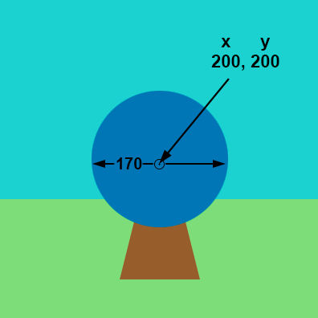

## Draw your target

Your game needs a target to shoot arrows at.

{:width="300px"}

### Draw a triangular stand

--- task ---

Set the fill colour to `brown`.

Draw a triangle using the x and y coordinates for each of the corners.

{:width="400px"}

--- code ---
---
language: python
line_numbers: true
line_number_start: 20
line_highlights: 22-23
---
    fill('lightgreen')  
    rect(0, 250, 400, 150)  
    fill('brown') 
    triangle(150, 350, 200, 150, 250, 350)  

--- /code ---

--- /task ---

--- task ---

**Test:** Run your code to see the stand for your target: 

{:width="400px"}

--- /task ---

### Draw the target circles

--- task ---

The largest part of the target is a blue **circle**.

Set the fill colour to `blue`. 

Draw a circle with x and y coordinates for its centre and a width. 

{:width="400px"}

--- code ---
---
language: python
line_numbers: true
line_number_start: 22
line_highlights: 24-25
---

    fill('brown')  # Brown colour
    triangle(150, 350, 200, 150, 250, 350)  # Draw a triangle for the target's stand 
    fill('blue')  # Set the circle fill colour to blue
    circle(200, 200, 170)  # Draw the outer circle
  
--- /code ---

--- /task ---

--- task ---

**Test:** Run your code to see the first large blue circle. 

The blue circle was drawn after the stand so it is in front.

{:width="400px"}

--- /task ---

The target is made of different-sized circles with the same centre coordinates (200, 200). 

--- task ---

**Add** coloured circles for the inner and middle parts of the target. 

--- code ---
---
language: python
filename: main.py - draw()
line_numbers: true
line_number_start: 22
line_highlights: 26-30
---

    fill('brown')  # Brown colour
    triangle(150, 350, 200, 150, 250, 350)  # Draw a triangle for the target's stand 
    fill('blue')  # Set the circle fill colour to blue
    circle(200, 200, 170)  # Draw the outer circle
    fill('red')  # Set the colour for the circle fill to red
    circle(200, 200, 110)  # Draw the inner circle using x, y, width
    fill('yellow')  # Set the colour for the circle fill to yellow      
    circle(200, 200, 30)  # Draw the middle circle using x, y, width

--- /code ---

--- /task ---

--- task ---

**Test:** Run your project to see the target with three coloured circles. 

{:width="400px"}

--- /task ---

--- save ---
