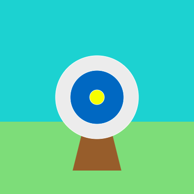

## Draw your target

In this step you will create a target stand and a target with coloured circles — smaller circles are worth more points than larger ones. 

{:width="300px"}

--- task ---

The wooden stand will sit behind the target circles so needs to be drawn first. The order in which you draw things can be very important for complex images.

Draw a **triangle** using the function `triangle(x1, y1, x2, y2, x3, y3)`. Triangles have three sets of coordinates each representing the position of one of the triangle's corners. 

The stand will have corners at (150, 350), (200, 150), and (250, 350).

--- code ---
---
language: python
filename: main.py - draw()
line_numbers: true
line_number_start: 27 
line_highlights: 30-32
---
  fill(GRASS)
  rect(0, 250, 400, 150) # x, y, width, height
  
  # Draw a target
  fill(WOOD) # Set the fill colour to wood
  triangle(150, 350, 200, 150, 250, 350)

--- /code ---

--- save ---

--- /task ---

--- task ---

**Test:** Run your code to see the stand for your target. 

--- /task ---

--- task ---

The largest part of the target will be a `GREY` **circle** using `ellipse(x, y, width, height)`. The **x** and **y** coordinates are the centre position of the circle. 

**Tip:** To make a perfect circle the **width** and **height** must be the same. 

--- code ---
---
language: python
filename: main.py - draw()
line_numbers: true
line_number_start: 30
line_highlights: 33-35
---

# Draw a target
  fill(WOOD)
  triangle(150, 350, 200, 150, 250, 350)
  fill(GREY)
  # 200, 200 is the middle of the screen.
  ellipse(200, 200, 170, 170) 
  
--- /code ---

--- save ---

--- /task ---

--- task ---

**Test:** Run your code to see the first large grey circle.

**Debug:** You might have used a different spelling of 'grey' — this is one of those words that has a different spelling in different parts of the English-speaking world.

--- /task ---

The starter project had colours `SKY`, `GRASS`, `WOOD` and `GREY` defined as global variables. When you make a variable `global` it can be read from anywhere in the project. 

--- task ---

Create two new global variables to store colours `BLUE` and `YELLOW` for the remaining circles:

 + Add the `BLUE` and `YELLOW` variables to the line that makes the variables global (don't forget the commas!)
 + Assign colours to the `BLUE` and `YELLOW` variables using `color()`

The `color()` function expects three numbers: one each for red, green, and blue.

[[[generic-theory-simple-colours]]]

--- code ---
---
language: python
filename: main.py - draw()
line_numbers: true
line_number_start: 
line_highlights: 
---

def draw():
  
  global SKY, GRASS, WOOD, GREY, WHITE, BLUE, YELLOW 
 
  GRASS = color(149, 212, 122)
  SKY = color(92, 204, 206)
  WOOD = color(145, 96, 51)
  WHITE = color(255,255,255)
  GREY = color(236, 236, 236) # The outter circle
  BLUE = color(0, 110, 191) # The inner circle
  YELLOW = color(252, 249, 0) # The bullseye

--- /code ---

--- /task ---

--- task ---

The target will be made of up a number of circles with different sizes but the same centre coordinates. 

Add two more circles to represent an inner circle and the bullseye. Change the `fill()` before drawing each circle. 

--- code ---
---
language: python
filename: main.py - draw()
line_numbers: true
line_number_start: 
line_highlights: 
---

# Draw a target
  fill(WOOD)
  triangle(150, 350, 200, 150, 250, 350) # Stand
  fill(GREY)
  ellipse(200, 200, 170, 170) # Outter circle
  fill(BLUE)
  ellipse(200, 200, 110, 110) # Inner circle
  fill(YELLOW)
  ellipse(200, 200, 30, 30) # Bullseye
  
--- /code ---

--- save ---

--- /task ---

--- task ---

**Test:** Run your project again to see the target with three colour circles.

**Debug:** You might have used 'colo**u**r' instead of 'color'. Just like with 'gr**e**y' and 'gr**a**y', these words have diffrent spellings in different places. The makers of Python use the 'color' spelling, so you have to use it too!

--- /task ---

In Japan, the Samurai introduced a requirement for learning archery. The Japanese martial art of archery is known as Kyūdō and the bullseye is called zuboshi. The term zuboshi is also used in English; to show that someone has done or said something that is "exactly right."

--- task ---

You set `no_stroke()` when drawing your background, so all of the shapes after that have been drawn without a **stroke** outline too.

A `WHITE` variable has been created for you. The RGB colour values for white are (255, 255, 255) this is the maximum amount of each colour. What do you think the values for black are?

Set the colour of the `stroke()` to `WHITE` for the circles. To control the thinkness of the outline, add `stroke_weight()` and set this to `3`. 

--- code ---
---
language: python
filename: main.py - draw()
line_numbers: true
line_number_start: 
line_highlights: 
---

 # Draw a target
  fill(WOOD_BROWN)
  triangle(150, 350, 200, 150, 250, 350)
  stroke(WHITE) # A white outline
  stroke_weight(3) # A thick outline
  fill(GREY)
  ellipse(200, 200, 170, 170)
--- /code ---

--- save ---

--- /task ---

--- task ---

**Test:** Run your project to see the outline around the circles in your target. 

--- /task ---
