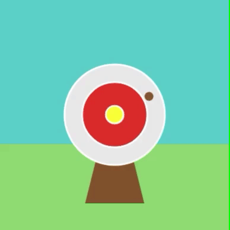

## Add an arrow

Add an even smaller circle to represent an arrow.

{:width="300px"}

### Where will you shoot?

--- task ---

Add a function to draw a brown circle at coordinates `200`, `200`. 

--- code ---
---
language: python
line_numbers: true
line_number_start: 8
line_highlights: 9-13
---
# The shoot_arrow function goes here    
def shoot_arrow():   
    arrow_x = 200
    arrow_y = 200
    fill('brown')
    circle(arrow_x, arrow_y, 15)

--- /code ---

--- /task ---

--- task ---

Call your new `shoot_arrow()`{:.language-python} function at the end of your `draw()`{:.language-python} function. 

--- code ---
---
language: python
line_numbers: true
line_number_start: 33
line_highlights: 35
---
    fill('yellow')      
    circle(200, 200, 30)  
    shoot_arrow()

--- /code ---

--- /task ---

--- task ---

**Test:** Click the **Run** button. You should see the arrow in the centre.

**Test:** Click the **Run** button. You should see the arrow in the centre.

--- /task ---

The arrow needs to move randomly.

--- task ---

Change the `arrow_x`{:.language-python} and `arrow_y`{:.language-python} variables to choose a random number between 100 and 300.

--- code ---
---
language: python
line_numbers: true
line_number_start: 9
line_highlights: 10-11
---
def shoot_arrow():
    arrow_x = randint(100, 300)
    arrow_y = randint(100, 300)
    fill('brown')
    circle(arrow_x, arrow_y, 15)

--- /code ---

--- /task ---

--- task ---

**Test:** Click the **Run** button. You should see the arrow jump around the target.

--- /task ---

--- save ---
