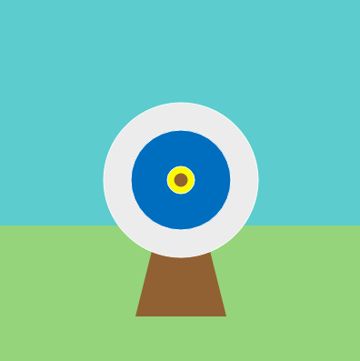
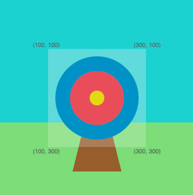

## Fire your arrow

Now it's time to add an arrow that moves randomly across the target area.

{:width="300px"}

--- task ---

Find the comment **#The shoot_arrow function goes here** and below it add code to define your `shoot_arrow()` function. 

Add a small `ellipse()` in the centre of the screen to represent the arrow.

--- code ---
---
language: python
filename: main.py — shoot_arrow()
line_numbers: true
line_number_start: 10
line_highlights: 11-12
---

#The shoot_arrow function goes here    
def shoot_arrow():   
  ellipse(200, 200, 15, 15)

--- /code ---

--- /task ---

--- task ---

Go to the `draw()` code that creates the target and add code at the end to set the `fill()` to `wood`, then call your new `shoot_arrow()` function. 

--- code ---
---
language: python
filename: main.py — draw()
line_numbers: true
line_number_start: 41
line_highlights: 44-45
---

  fill(bullseye)    
  ellipse(200, 200, 30, 30)    
  
  fill(wood)   
  shoot_arrow()   

--- /code ---

--- /task ---

--- task ---

**Test:** Run you code and see the arrow appear in the bullseye.

--- /task ---

 Computer games, videos, and animations create the effect of movement by showing lots of images one after another. Each image is called a  frame . The speed that the image changes at is called the frame rate and is given in fps or frames per second.  

The `frame_rate(2)` line in `setup()` sets the frame rate to 2 frames per second.

The `draw()` function is called every frame. You are going to draw the arrow in a random position each time `draw()` is called. 

The background and target will be drawn over the old arrow. This means you only see one arrow at a time.

--- task ---

Find the `import` statements, at the top of your code, you are going to use `randint` from the `random` library. 

--- code ---
---
language: python
filename: main.py
line_numbers: true
line_number_start: 3
---

#Import library code    
from p5 import *    
from math import *    
from random import randint    

--- /code ---

--- /task ---

--- task ---

Go to your `shoot_arrow()` function and add two new `arrow_x` and `arrow_y` variables to store random numbers between `100` and `300`. 

This will let some shots miss the target, without them going all the way to the edges of your game.

Change your `ellipse()` to use the new variables to position your arrow. 

--- code ---
---
language: python
filename: main.py — shoot_arrow()
line_numbers: true
line_number_start: 10
line_highlights: 12-14
---

#The shoot_arrow function goes here    
def shoot_arrow():    
  arrow_x = randint(100, 300)   
  arrow_y = randint(100, 300)    
  ellipse(arrow_x, arrow_y, 15, 15) #Upate to random coordinates    

--- /code ---

--- /task ---

### Get the colour the arrow hits

The `get()` function returns the colour of a pixel.

A pixel, short for picture element, is a single coloured dot within an image. Images are made up of lots of coloured pixels.

--- task ---

You need to store the colour that the arrow is aiming at before you draw an arrow on top of it.

Add code to store the `hit_color`. Use the `get()` function, to get the colour of the pixel at the `arrow_x` and `arrow_y` coordinates — the centre of the arrow. 

--- code ---
---
language: python
filename: main.py — shoot_arrow() 
line_numbers: true
line_number_start: 10
line_highlights: 14
---

#The shoot_arrow function goes here     
def shoot_arrow():    
  arrow_x = randint(100, 300)    
  arrow_y = randint(100, 300)    
  hit_color = get(arrow_x, arrow_y) #Save the colour before drawing the arrow   
  ellipse(arrow_x, arrow_y, 15, 15)   

--- /code ---

**Tip:** The code to get the colour and save it needs to be **before** the code to draw the ellipse otherwise you will always save the wood colour of the arrow! 

--- /task ---

The `p5` library 'listens' for certain events, one of these is the press of the mouse button. When it detects that the button has been pressed, it will run whatever code it has been given in the `mouse_pressed()` function.

--- task ---

Find the comment **#The mouse_pressed function goes here** and below it add code to define your `mouse_pressed()` function. 

Add code to print the amounts of red, green, and blue in the pixel the arrow lands on. 

--- code ---
---
language: python
filename: main.py - mouse_pressed()
line_numbers: true
line_number_start: 8
line_highlights: 9-10
---

#The mouse_pressed function goes here    
def mouse_pressed():    
  print( red(hit_color), green(hit_color), blue(hit_color) )

--- /code ---

--- /task ---

--- task ---
You have defined two functions `shoot_arrow()` and `mouse_pressed()`, both of these functions need to use the `hit_color` variable. 

A variable that needs to be used thoughout a program is known as a **global variable**. Add code to your `shoot_arrow()` function to make `hit_color` a global variable:

--- code ---
---
language: python
filename: main.py - shoot_arrow()
line_numbers: true
line_number_start: 12
line_highlights: 14
---

#The shoot_arrow function goes here    
def shoot_arrow():    
  global hit_color #Can be used in other functions     
  arrow_x = randint(100, 300)     
  arrow_y = randint(100, 300)     
  hit_color = get(arrow_x, arrow_y) #Save the colour before drawing the arrow     
  ellipse(arrow_x, arrow_y, 15, 15)     

--- /code ---

--- /task ---

--- task ---

**Test:** Run your project. The arrow is redrawn at random coordinates. 

The project gets the `hit_color` each time the arrow is redrawn and prints the colour value in the output area underneath the target.

**Debug:** If you are seeing a message about `hit_colour` being 'not defined', then go back to `shoot_arrow()` and check that you have the `global hit_color` line.

**Debug:** Check the `print` line really carefully for commas and brackets. 

--- /task ---

--- save ---

