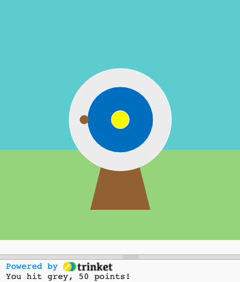
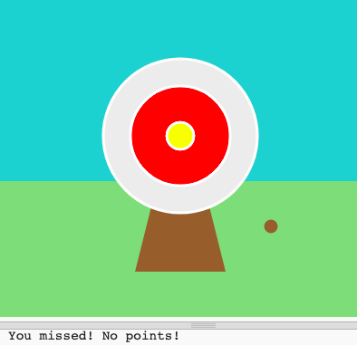

## Score points

In this step you will add scores based on where the arrow hits.

{:width="300px"}

The p5 library is 'listening' for certain events, one of these is the press of the mouse button. When it knows that the button has been pressed, it will run whatever code it has been given in the `mouse_pressed()` function.

--- task ---

Find the comment **# The mouse_pressed function goes here** and below it add code to define your `mouse_pressed()` function. 

--- code ---
---
language: python
filename: main.py - mouse_pressed()
line_numbers: true
line_number_start: 8
line_highlights: 9-11
---
# The mouse_pressed function goes here
def mouse_pressed():

--- /code ---

--- /task ---

We use  conditions all the time to make decisions. We could say 'if the pencil is blunt, then sharpen it'. `if` conditions let us write code that does something different depending on whether a condition is true or false.

--- task ---

To `print` a message for the target's outter circle, add code to your `mouse_pressed()` function to check if the `hit_color` is `==` to `GREY`. 

Be careful when using the `=` symbol in Python: 
 + `=` is used for **assignment** — like `arrow_x = 200` to set the value of a variable, . 
 + `==` is used to test **equivalence** — like `hit_color == YELLOW` — if the things on either side have the same value, then the test is `True`, otherwise it is `False`.

--- code ---
---
language: python
filename: main.py - mouse_pressed()
line_numbers: true
line_number_start: 9
line_highlights: 10-14
---
# The mouse_pressed function goes here
def mouse_pressed():
  if hit_color == GREY:
    # Like functions, if statements are indented
    print('You hit grey, 50 points!')

--- /code ---

--- /task ---

--- task ---

**Test:** Run your project. Try to stop the arrow on the grey outter circle to see your message. 
 
**Tip:** `frame_rate()`, in `setup()`, controls how fast your game draws. If it's going too fast, set it to a lower number. 

**Debug:** Make sure your code matches exactly and you indented the code inside your `if`. The indent tells Python which code should only run if the condition is `True`.

--- /task ---

`GREY` is not the only colour you need to check for, points will be scored if the arrow lands on `BLUE` or `YELLOW` circles too. To do this use `elif` (a shortened version of else - if). 

We use  else - if  all the time to make decisions in real life. When you are painting a picture of the sky you might check if there is a yellow paint for the sun. Else if there is no yellow paint you look for orange. Else if there is no yellow or orange paint you might use red - really lightly!

--- task ---

An `elif` can only be used with an `if` statement and like an `if` it checks a condition. If the condition is `True`, the `elif` runs some code. What makes `elif` different is that it will only make that check if the conditions of the `if` and any `elif`s before it have been `False`.

Add `elif` statements for `BLUE` and `YELLOW`.

--- code ---
---
language: python
filename: main.py - mouse_pressed()
line_numbers: true
line_number_start: 9
line_highlights: 13-16
---
def mouse_pressed():
  if hit_color == GREY:
    # Like functions, if statements are indented
    print('You hit grey, 50 points!')
  elif hit_color == BLUE:
    print('You hit blue, 200 points!')
  elif hit_color == YELLOW:
    print('You hit yellow, 500 points!')

--- /code ---

--- /task ---

--- task ---

**Test:** Run your project. Try to stop the arrow on the blue and yellow circles to see their messages.

**Debug:** Make sure your `elif` is at the same indentation level as your `if`, and the code inside your `elif` is at the same level as the code inside your `if`.

--- /task ---

There is one more decision we need to make: What happens if the arrow does not land on any of the target circles? To do this last check we use `else`.

We use  if … else  all the time to make decisions in real life. When you wake up you check and if it is morning you get up else you go back to sleep. Can you think of any if ... else decisions you make? 

--- task ---

Add code to `print` a message `else` none of the `if` and `elif` statements have been met.

--- code ---
---
language: python
filename: main.py
line_numbers: true
line_number_start: 9
line_highlights: 17-18
---
def mouse_pressed():
  if hit_color == GREY:
    # Like functions, if statements are indented
    print('You hit grey, 50 points!')
  elif hit_color == BLUE:
    print('You hit blue, 200 points!')
  elif hit_color == YELLOW:
    print('You hit yellow, 500 points!')
  else:
    print('You missed! No points!')

--- /code ---

--- /task ---

--- task ---

**Test:** Run your project. Try to stop the arrow in the grass or sky, to see the miss message.

--- /task ---

--- save ---
