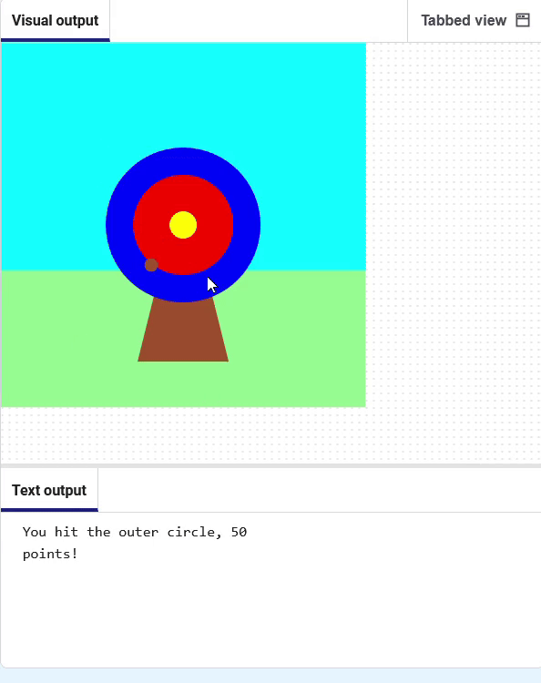
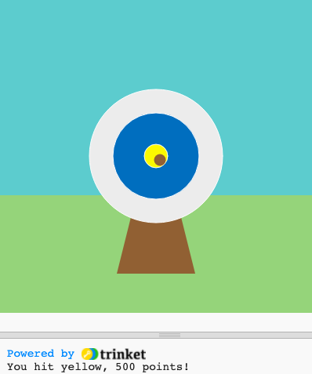

## Score points

Add a score based on where the arrow hits.

{:width="300px"}

--- task ---

Comment out the line to print the 🎯 character so that it no longer runs.

--- code ---
---
language: python
line_numbers: true
line_number_start: 6
line_highlights: 7
---
def mouse_pressed():
    # print('🎯')

--- /code ---

--- /task ---

--- task ---

Display a message **if** the `hit_colour`{:.language-python} is equal to the `outer` circle colour (blue). 

--- code ---
---
language: python
line_numbers: true
line_number_start: 6
line_highlights: 8-9
---
def mouse_pressed():    
    # print('🎯')
    if hit_colour == Color('blue').hex:
        print('You hit the outer circle, 50 points!')

--- /code ---

**Tip:** If you changed the colour of your outer circle then you will need to replace `blue` with the colour name that you have chosen.

--- /task ---

--- task ---

**Test:** Click the **Run** button. Wait for the arrow to land on the blue circle, then click your left mouse button.

--- /task ---

`elif`{:.language-python} can be used to add more conditions to your `if`{:.language-python} statement. 

--- task ---

Add some more code to score points if the arrow lands on the **inner** or **middle** circles.

--- code ---
---
language: python
line_numbers: true
line_number_start: 6
line_highlights: 10-14
---

def mouse_pressed():
    # print('🎯')
    if hit_colour == Color('blue').hex:
        print('You hit the outer circle, 50 points!')
    elif hit_colour == Color('red').hex:
        print('You hit the inner circle, 200 points!')
    elif hit_colour == Color('yellow').hex:
        print('You hit the middle, 500 points!')
--- /code ---

--- /task ---

--- task ---

**Test:** Click the **Run** button.You should score points whenever you hit the target.

--- /task ---

### Missing the target

There is one more decision you need to make: what happens if the arrow does not land on any of the target circles?

To do this last check, you use `else`{:.language-python}.

--- task ---

Add code to `print` a message when none of the `if` and `elif` statements are true.

--- code ---
---
language: python
line_numbers: true
line_number_start: 12
line_highlights: 14-15
---

    elif hit_colour == Color('yellow').hex:
        print('You hit the middle, 500 points!')
    else:   
        print('You missed! No points!')
--- /code ---

--- /task ---

--- task ---

**Test:** Click the **Run** button. Fire the arrow in the grass or sky to see the miss message.

--- /task ---

--- save ---
