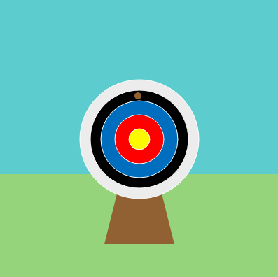

## Upgrade your project

Summary or upgrade project task

{:width="300px"}

--- task ---

You could:

+ Make the game easier or harder by changing the frameRate(5) value
+ Add more circles that score points based on their position
+ Use `input` to ask the user which difficulty level

--- collapse ---

---
title: Use input to control frameRate()
---

--- code ---
---
language: python
filename: main.py - setup
line_numbers: true
line_number_start: 11
line_highlights: 12
---
def setup():
  difficulty = input('Which difficulty level would you like? 1, 2 or 3:')
  if difficulty == 1:
    frame_rate(3)
  elif difficulty == 2:
    frame_rate(5)
  elif difficulty == 3:
    frame_rate(7)
  else:
    frame_rate(5)
--- /code ---

--- /collapse ---

Here’s an example that uses five target circles each scoring a different number of points:

--- no-print ---

<iframe src="https://trinket.io/embed/python/e7feefb6dc?outputOnly=true&start=result" width="600" height="500" frameborder="0" marginwidth="0" marginheight="0" allowfullscreen>
</iframe>

--- /no-print ---

--- print-only ---

--- /print-only ---

--- /task ---

--- collapse ---

---
title: Completed project
---

You can view the [completed project here](https://trinket.io/python/e7feefb6dc){:target="_blank"}.

--- /collapse ---

--- save ---
