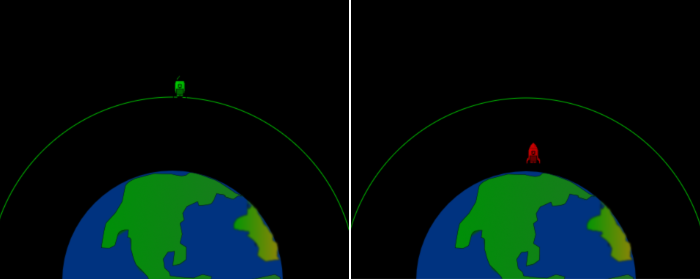

## What next?

If you are following the [Intro to Python](https://projects.raspberrypi.org/en/raspberrypi/python-intro) pathway, you can move on to the [Rocket launch](https://projects.raspberrypi.org/en/projects/rocket-launch) project. In this project, you will make an interactive animation of a rocket launching into orbit. 

--- print-only ---

--- /print-only ---

--- no-print ---

**Try it:** Your program will adjust the animation based on how powerful you make the engine and how much fuel you put in the rocket, to decide whether the rocket successfully enters orbit. How much fuel do you want to use? 

**Tip:** around 5000 kg should be enough but experiment with the numbers.

<iframe src="https://trinket.io/embed/python/ced6bff454?outputOnly=true&start=result" width="600" height="500" frameborder="0" marginwidth="0" marginheight="0" allowfullscreen>
</iframe>

--- /no-print ---

If you want to have more fun exploring Python, then you could try out any of [these projects](https://projects.raspberrypi.org/en/projects?software%5B%5D=python).

