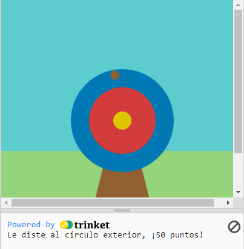

  <a class="c-survey-banner__link" href="https://form.raspberrypi.org/f/code-editor-feedback" target="_blank">Take our survey</a> to help make our Code Editor better!

## Lo que harás

Usa Python, con la biblioteca de gráficos `p5`, para dibujar una diana y ganar puntos golpeándolo con flechas.

Vas a:
 + Personalizar tu juego con **colores RGB**
 + Usar **declaraciones condicionales** (`if`, `elif`, `else`) para tomar decisiones
 + Posicionar formas con **coordenadas x, y**

--- no-print ---

### Reproducir ▶️

--- task ---

  

Haz clic en el botón **Ejecutar** abajo para iniciar el juego. Cuando aparezca el punto en el objetivo 🎯, haz clic con el mouse (o toca en tu tableta) para disparar tu flecha. 

Inténtalo. Tu puntaje aparece en el área de resultados debajo del objetivo. ¿Cómo cambia to puntaje cuando la flecha cae en colores diferentes? 
  <iframe src="https://editor.raspberrypi.org/en/embed/viewer/target-practice-solution" width="400" height="710" frameborder="0" marginwidth="0" marginheight="0" allowfullscreen>
  </iframe>

**Tip:** 💡 When you press **Stop** you will see a prompt that says 'Execution interrupted'. This just means that you have stopped the program whilst the code was still running.

--- /task ---

--- /no-print ---

--- print-only ---

{:width="640px"}

--- /print-only ---

La evidencia más antigua de  tiro con arco  proviene de la cueva de Sibudu en KwaZulu-Natal, Sudáfrica. Se han encontrado restos de puntas de flecha de piedra y hueso, que datan de 60,000 a 70,000 años atrás. 

