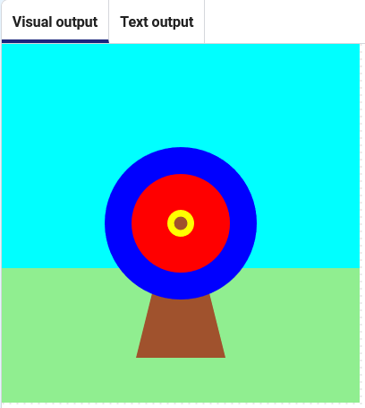

## Dispara tu flecha

Añade un círculo aún más pequeño para representar una flecha.

{:width="300px"}

### ¿Donde dispararás?

--- task ---

Agrega una función para dibujar un círculo marrón en las coordenadas `200`, `200`.

--- code ---
---
language: python filename: main.py - mouse_pressed() line_numbers: true line_number_start: 7
line_highlights: 10, 11, 12, 13, 14
---
# La función disparar_flecha va aquí
def disparar_flecha():    
global color_de_impacto # Se puede utilizar en otras funciones     
flecha_x = randint(100, 300)     
flecha_y = randint(100, 300)     
color_de_impacto = get(flecha_x, flecha_y) # Guardar el color antes de dibujar la flecha fill(madera)     
circle(flecha_x, flecha_y, 15)

--- /code ---

--- /task ---

--- task ---

Ve a la función `draw` y llama a tu nueva función `disparar_flecha`.

--- code ---
---
language: python filename: main.py — draw() line_numbers: true line_number_start: 42
line_highlights: 44
---

    fill(medio) 
      circle(200, 200, 30) 
      disparar_flecha()

--- /code ---

--- /task ---

--- task ---

**Test:** Ejecuta tu proyecto. Deberías ver la flecha en el centro.

--- /task ---

La flecha debe moverse aleatoriamente.

--- task ---

Change the `arrow_x`{:.language-python} and `arrow_y`{:.language-python} variables to choose a random number between 100 and 300.

--- code ---
---
language: python filename: main.py — disparar_flecha() line_numbers: true line_number_start: 9
line_highlights: 13
---
def disparar_flecha():    
flecha_x = randint(100, 300)    
flecha_y = randint(100, 300)    
color_de_impacto = get(flecha_x, flecha_y) # Consigue el color en que cayó la flecha fill(madera)  
circle(flecha_x, flecha_y, 15)

--- /code ---

--- /task ---

--- task ---

**Test:** Click the **Run** button. Deberías ver la flecha saltar alrededor del objetivo.

--- /task ---

--- save ---
