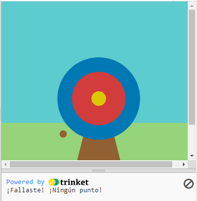

## Gana puntos

Tu juego agregará puntajes según el lugar donde golpea la flecha.

{:width="300px"}

--- task ---

Ve a la función `draw()` y agrega `, outer, inner, middle` a la lista de variables globales.

--- code ---
---
language: python filename: main.py line_numbers: true line_number_start: 26
line_highlights: 28
---

def draw():
# Cosas que hacer en cada cuadro
  global wood, outer, inner, middle    
sky = color(92, 204, 206) # Red = 92, Green = 204, Blue = 206    
grass = color(149, 212, 122)    
wood = color(145, 96, 51)    
outer = color(0, 120, 180)    
inner = color(210, 60, 60)   
middle = color(220, 200, 0)

--- /code ---

--- /task ---

Usamos condiciones todo el tiempo para tomar decisiones. Podríamos decir 'si el lápiz está desafilado, entonces afilalo'. De manera similar, las condiciones `if` nos permiten escribir código que hace algo diferente dependiendo de si una condición es verdadera o falsa.

### Mostrar el puntaje

--- task ---

Borra❌ la línea de código `print( red(hit_color), green(hit_color), blue(hit_color) )`.

--- code ---
---
language: python filename: main.py - mouse_pressed() line_numbers: true line_number_start: 7
line_highlights: 9
---
# La función mouse_presionado va aquí
def mouse_pressed():

--- /code ---

--- /task ---

--- task ---

`print` a message `if` the `hit_color` is equal to `outer` 🎯.

Nota 👀 que el código usa dos signos de igual `==` para significar **igual a**.

--- code ---
---
language: python filename: main.py - mouse_pressed() line_numbers: true line_number_start: 7
line_highlights: 9, 10
---

# La función mouse_pressed va aquí
def mouse_pressed():     
if hit_color == outer:      
print('You hit the outer circle, 50 points!') # Al igual que las funciones, las declaraciones 'if' están indentandas

--- /code ---

--- /task ---

--- task ---

**Prueba:** Ejecuta tu proyecto. Intenta detener la flecha en el círculo exterior azul para ver su mensaje.

**Consejo:** 💡 `frame_rate()`, en `setup`, controla qué tan rápido se dibuja tu juego. Si va demasiado rápido, configúralo en un número más bajo.

**Debug:** Asegúrate de que tu código coincida exactamente y de que hayas indentado el código dentro de tu declaración `if`.

--- /task ---

`elif` (else - if) se puede usar para agregar más condiciones a tu declaración `if`. Estos se leerán de arriba a abajo. Tan pronto como se encuentre una condición **Verdadera**, se actuará. Las condiciones restantes serán ignoradas.

--- task ---

Gana puntos si la flecha cae en los círculos `interior` o `medio` 🎯:

--- code ---
---
language: python filename: main.py - mouse_pressed() line_numbers: true line_number_start: 8
line_highlights: 11, 12, 13, 14
---

def mouse_pressed():    
if hit_color == outer:    
print('You hit the outer circle, 50 points!')    
elif hit_color == inner:    
print('You hit the inner circle, 200 points!')   
elif hit_color == middle:    
print('You hit the middle, 500 points!')

--- /code ---

--- /task ---

--- task ---

**Prueba:** Ejecuta tu proyecto. Intenta detener la flecha en los círculos interior y medio para ver sus mensajes.

**Debug:** 🐞 Comprueba que tu sangría coincida con el ejemplo.

**Debug:** 🐞 Si ve un mensaje sobre `inner` o `middle` que están 'not defined', vuelve a `draw()` y verifica que estén en la línea que declara variables globales.

--- /task ---

### Fallar el blanco

Hay una decisión más que debes tomar: ¿qué sucede si la flecha no aterriza en ninguno de los círculos del blanco? ❌

Para hacer esta última verificación, usa `else`.

--- task ---

Agrega código a `print` para mostrar un mensaje `else` ya que ninguna de las condiciones `if` y `elif` se han cumplido.

--- code ---
---
language: python filename: main.py line_numbers: true line_number_start: 8
line_highlights: 15, 16
---

def mouse_pressed():    
if hit_color == outer:   
print('You hit the outer circle, 50 points!')   
elif hit_color == inner:   
print('You hit the inner circle, 200 points!')   
elif hit_color == middle:    
print('You hit the middle, 500 points!')   
else:   
print('You missed! ¡Sin puntos!')

--- /code ---

--- /task ---

--- task ---

**Prueba:** 🔄 Ejecuta tu proyecto. Intenta detener la flecha en el pasto o el cielo para ver el mensaje de error.

**Elije:** 💭 Cambia la cantidad de puntos que ganas para los diferentes colores si así lo deseas.

--- /task ---

