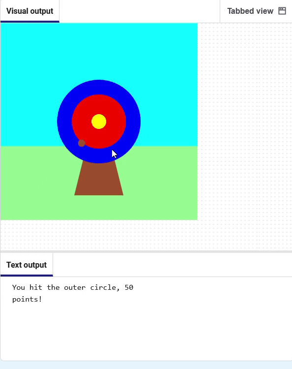
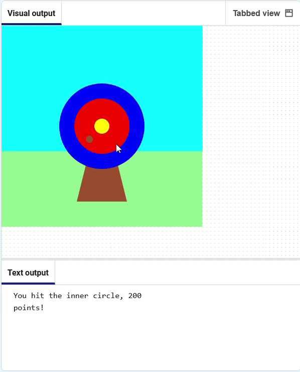

## Gana puntos

Añade una puntuación basada en dónde impacta la flecha.

{:width="300px"}

--- task ---

Comenta la línea para imprimir el carácter 🎯 para que ya no se ejecute.

--- code ---
---
language: python line_numbers: true line_number_start: 6
line_highlights: 7
---
def mouse_pressed(): # print('🎯')

--- /code ---

--- /task ---

--- task ---

Muestra un mensaje **si (if)** el `hit_colour`{:.language-python} es igual al `color del círculo exterior` (azul).

--- code ---
---
language: python line_numbers: true line_number_start: 6
line_highlights: 8-9
---
def mouse_pressed():    
# print('🎯') if hit_colour == Color('blue').hex: print(''Le diste al círculo externo, ¡50 puntos!')

--- /code ---

**Consejo:** Si cambiaste el color de tu círculo exterior, deberás reemplazar `blue (azul)` con el nombre del color que hayas elegido.

--- /task ---

--- task ---

**Prueba:** Haz clic en el botón **Ejecutar (Run)**. Espera a que la flecha aterrice en el círculo azul y luego haz clic con el botón izquierdo del mouse. 

--- /task ---

`elif`{:.language-python} se puede usar para agregar más condiciones a tu declaración `if`{:.language-python}.

--- task ---

Agrega más código para sumar puntos si la flecha cae en los círculos **internos ** o en los círculos **centrales **.

--- code ---
---
language: python line_numbers: true line_number_start: 6
line_highlights: 10-14
---

def mouse_pressed(): # print('🎯') if hit_colour == Color('blue').hex: print(''Le diste al círculo externo, ¡50 puntos!') elif hit_colour == Color('red').hex: print('You hit the inner circle, 200 points!') elif hit_colour == Color('yellow').hex: print('¡Le diste al centro, 500 puntos!')

--- /code ---

--- /task ---

--- task ---

**Test:** Click the **Run** button.You should score points whenever you hit the target.

--- /task ---

### Fallar el blanco

There is one more decision you need to make: what happens if the arrow does not land on any of the target circles?

To do this last check, you use `else`{:.language-python}.

--- task ---

Add code to `print` a message when none of the `if` and `elif` statements are true.

--- code ---
---
language: python line_numbers: true line_number_start: 12
line_highlights: 14-15
---

    elif hit_colour == Color('yellow').hex:
            print('¡Le diste al centro, 500 puntos!')
    else:   
        print('¡Fallaste! ¡Sin puntos!')

--- /code ---

--- /task ---

--- task ---

**Test:** Click the **Run** button. Fire the arrow in the grass or sky to see the miss message.

--- /task ---

--- save ---
