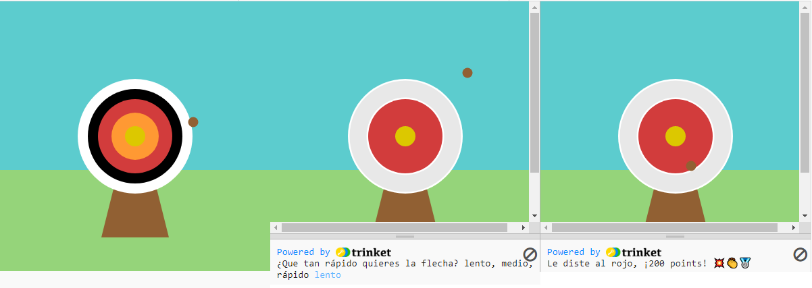

## Mejora tu proyecto

Personaliza y agrega más a tu proyecto. Quizás podrías cambiar el nivel de dificultad o agregar más círculos a tu objetivo.

{:width="300px"}

--- task ---

Tú podrías:

+ Agregar un `cuarto` y `quinto` círculo, en nuevos colores, que darán diferentes cantidades de puntos según su posición 🟠🟣
+ Pon emoji en tus mensajes impresos ([aquí hay una lista de emoji](https://unicode.org/emoji/charts/full-emoji-list.html){:target="_blank"} desde los que puedes copiar) 🎯
+ Haz que el juego sea más fácil o más difícil cambiando el valor de `frame_rate(2)` 💨
+ Usar `input()` para preguntar al usuario en qué nivel de dificultad quiere jugar 🗣️

--- /task ---

--- collapse ---
---
title: Proyecto terminado
---

You can view the [completed project here](https://editor.raspberrypi.org/en/projects/target-practice-solution){:target="_blank"}.

--- /collapse ---
