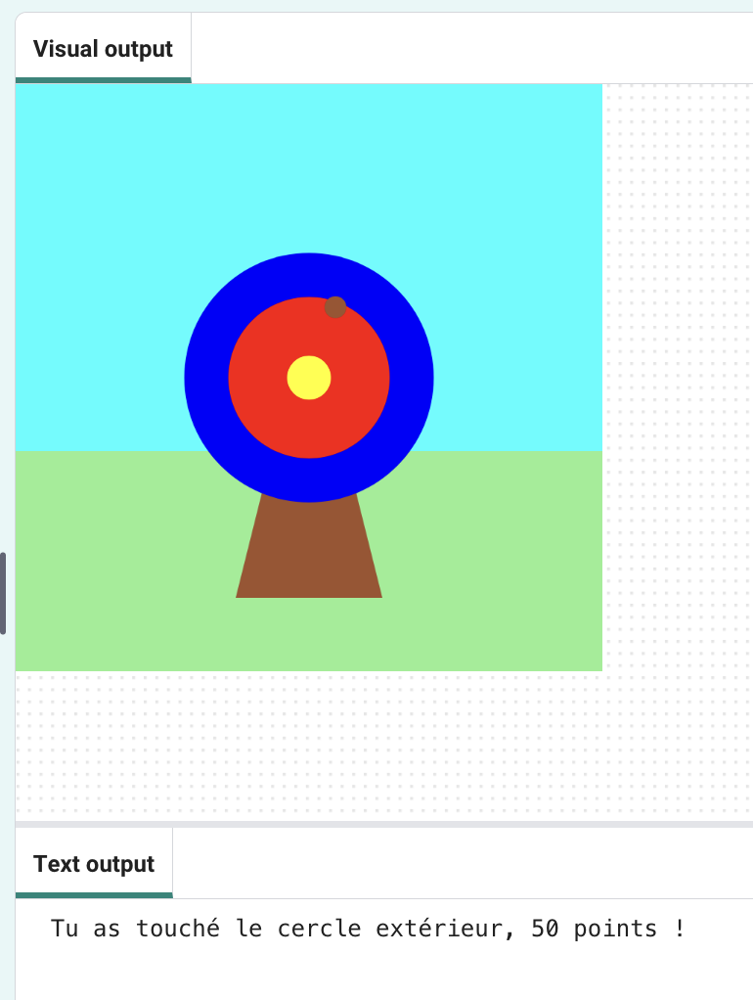

  <a class="c-survey-banner__link" href="https://form.raspberrypi.org/f/code-editor-feedback" target="_blank">Take our survey</a> to help make our Code Editor better!

## Ce que tu vas faire

Utilise Python, avec la bibliothèque graphique `p5` , pour dessiner une cible et marquer des points en la frappant avec des flèches.

Tu vas devoir :
 + Personnaliser ton jeu avec des **couleurs RVB**
 + Utiliser les **instructions conditionnelles** (`if`, `elif`, `else`) pour prendre des décisions
 + Positionner les formes avec les coordonnées **x, y**

--- no-print ---

### Joue ▶️

--- task ---

  

Clique sur le bouton **Run** ci-dessous pour démarrer le jeu. Lorsque le point apparaît sur la cible, clique sur la souris (ou appuye sur ta tablette) pour tirer ta flèche. 

Fais quelques essais. Ton score apparaît dans la zone de sortie sous la cible. Comment ton score change-t-il lorsque la flèche atterrit sur les différentes couleurs ? 
  <iframe src="https://editor.raspberrypi.org/en/embed/viewer/target-practice-solution" width="400" height="710" frameborder="0" marginwidth="0" marginheight="0" allowfullscreen>
  </iframe>

**Tip:** 💡 When you press **Stop** you will see a prompt that says 'Execution interrupted'. This just means that you have stopped the program whilst the code was still running.

--- /task ---

--- /no-print ---

--- print-only ---

{:width="640px"}

--- /print-only ---

La plus ancienne preuve de  tir à l'arc  provient de la grotte de Sibudu au KwaZulu-Natal, en Afrique du Sud. Des restes de pointes de flèches en pierre et en os ont été trouvés, qui datent d'il y a entre 60 000 et 70 000 ans. 

