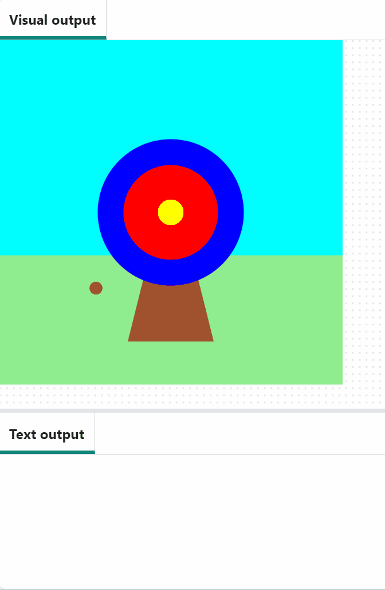
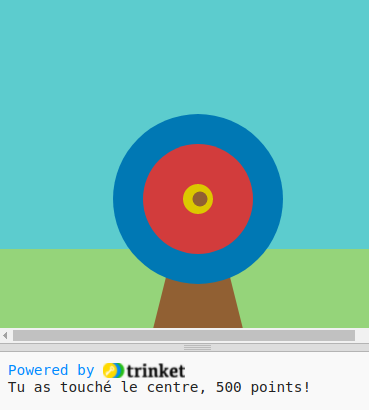
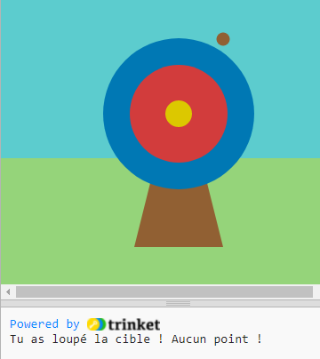

## Marquer des points

<div style="display: flex; flex-wrap: wrap">
<div style="flex-basis: 200px; flex-grow: 1; margin-right: 15px;">
Dans cette étape, tu ajouteras des points en fonction de l'endroit où la flèche frappe.
</div>
<div>

{:width="300px"}

</div>
</div>

--- task ---

Les variables de couleur dans la fonction `draw()` seront utilisées pour vérifier le score dans la fonction `mouse_pressed()`. Pour ce faire, elles doivent être définies en tant que variables globales :

--- code ---
---
language: python 
filename: main.py 
line_numbers: true 
line_number_start: 26
line_highlights: 28
---

def dessin():
#Choses à faire dans chaque image
  global exterieur, interieur, centre    
  ciel = color(92, 204, 206) #Rouge = 92, Vert = 204, Bleu = 206    
  herbe = color(149, 212, 122)    
  bois = color(145, 96, 51)    
  exterieur = color(0, 120, 180)    
  interieur = color(210, 60, 60)   
  centre = color(220, 200, 0)

--- /code ---

--- /task ---

<p style="border-left: solid; border-width:10px; border-color: #0faeb0; background-color: aliceblue; padding: 10px;">
Nous utilisons des <span style="color: #0faeb0; font-weight: bold;"> conditions</span> tout le temps pour prendre des décisions. On pourrait dire « si le crayon est émoussé, alors taille-le ». De même, les conditions "if" nous permettent d'écrire du code qui fait quelque chose de différent selon qu'une condition est vraie ou fausse.
</p>

--- task ---

Pour `imprimer` un message pour le cercle extérieur de la cible, ajoute du code à ta fonction `mouse_pressed()` pour vérifier si le `couleur_touche` est `==` à `exterieur`.

Sois prudent lorsque tu utilise le symbole `=` en Python :
 + `=` est utilisé pour **affectation** — comme `fleche_x = 200` pour définir la valeur d'une variable
 + `==` est utilisé pour tester **équivalence** — comme `couleur_touche == centre` — si les choses de chaque côté ont la même valeur, alors le test est `True`, sinon c'est `False`

Change le code dans ton `print()` pour donner un score :

--- code ---
---
language: python 
filename: main.py - mouse_pressed() 
line_numbers: true line_number_start: 8
line_highlights: 10-11
---

#La fonction mouse_pressed vient ici
def mouse_pressed():     
  if couleur_touche == exterieur:      
    print('tu as touché le cercle extérieur, 50 points !') #Comme les fonctions, les instructions "if" sont indentées

--- /code ---

--- /task ---

--- task ---

**Test :** Exécute ton projet. Essaye d'arrêter la flèche sur le cercle extérieur bleu pour voir ton message. La couleur du pixel au centre de la flèche est la couleur enregistrée et vérifiée.

**Astuce :** `frame_rate()`, dans `setup()`, contrôle la vitesse à laquelle ton jeu dessine. S'il va trop vite, régle-le sur un nombre inférieur.


**Debogage :** Assure-toi que ton code correspond exactement et que tu as indenté le code dans ton instruction `if`. L'indentation indique à Python que le code ne doit s'exécuter que si la condition est `True`.

--- /task ---

Comme des points seront marqués si la flèche atterrit également sur les cercles `intérieur` ou `centre`, `extérieur` n'est pas le seul cercle que tu dois vérifier. Pour ce faire, utilise `elif` (une version abrégée de else - if).

<p style="border-left: solid; border-width:10px; border-color: #0faeb0; background-color: aliceblue; padding: 10px;">
Nous utilisons <span style="color: #0faeb0; font-weight: bold;"> else - if </span> pour prendre des décisions dans la vraie vie. Lorsque tu peins une image du ciel, tu peux vérifier s'il y a une peinture jaune pour le soleil. Sinon, s'il n'y a pas de peinture jaune, tu recherches de l'orange. Sinon, s'il n'y a pas de peinture jaune ou orange, tu peux utiliser du rouge - très légèrement !
</p>

--- task ---

Un `elif` ne peut être utilisé qu'avec une instruction `if` et, comme un `if`, il vérifie une condition. Si la condition est `True`, le `elif` exécute du code.

Ce qui rend `elif` différent, c'est qu'il ne fera cette vérification que si les conditions du `if` et de tout `elif`s avant lui sont `False`.

Ajoute `elif` déclarations pour `intérieur` et `centre`.

--- code ---
---
language: python 
filename: main.py - mouse_pressed() 
line_numbers: true 
line_number_start: 9
line_highlights: 12-15
---

def mouse_pressed():    
  if couleur_touche == exterieur:    
    print('Tu as touché le cercle extérieur, 50 points !')    
  elif couleur_touche == interieur:    
    print('Tu as touché le cercle intérieur, 200 points !')   
  elif couleur_touche == centre:    
    print('Tu as touché le centre, 500 points !')

--- /code ---

--- /task ---

--- task ---

**Test :** Exécute ton projet. Essaye d'arrêter la flèche sur les cercles rouges et jaunes pour voir leurs messages.



**Debogage :** Assure-toi que ton `elif` est au même niveau d'indentation que ton `if`, et que le code à l'intérieur de ton `elif` est au même niveau que le code à l'intérieur de ton `if`.

**Débogage :** Si tu vois un message indiquant que `interieur` ou `centre` sont « non définis », reviens à `draw()` et vérifie qu'ils se trouvent sur la ligne qui déclare les variables globales.

```python
global exterieur, interieur, centre
```

--- /task ---

Il te reste une décision à prendre : que se passe-t-il si la flèche n'atterrit sur aucun des cercles cibles ? Pour faire cette dernière vérification, tu utilises `else`.

<p style="border-left: solid; border-width:10px; border-color: #0faeb0; background-color: aliceblue; padding: 10px;">
Nous utilisons <span style="color: #0faeb0; font-weight: bold;"> si … sinon </span> pour prendre des décisions. Quand tu te réveilles, tu vérifies et si c'est le matin tu te leves, sinon tu te rendors. Peux-tu penser à des décisions si ... sinon que tu prends ? 
</p>

--- task ---

Ajoute du code à `print` un message `else` si aucune des déclarations `if` et `elif` n'ont été remplies.

--- code ---
---
language: python 
filename: main.py 
line_numbers: true 
line_number_start: 9
line_highlights: 16-17
---

def mouse_pressed():    
  if couleur_touche == exterieur:   
    print('Tu as touché le cercle extérieur, 50 points !')   
  elif couleur_touche == interieur:   
    print('Tu as touché le cercle intérieur, 200 points !')   
  elif couleur_touche == centre:    
    print('Tu as touché le centre, 500 points !') 
  else:   
    print('Tu as loupé la cible ! Aucun point !')

--- /code ---

--- /task ---

--- task ---

**Test :** Exécute ton projet. Essaye d'arrêter la flèche dans l'herbe ou le ciel pour voir le message manqué. Modifie le nombre de points marqués pour les différentes couleurs si tu le souhaites.



--- /task ---

--- save ---
