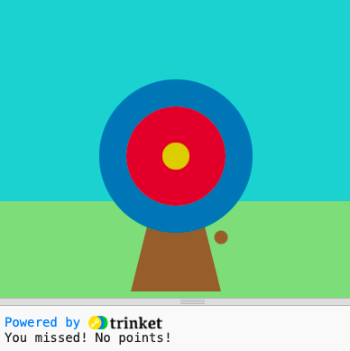

## Marquer des points

Ton jeu ajoutera des scores en fonction de l'endroit où la flèche frappe.

{:width="300px"}

--- task ---

Va dans la fonction `dessin()` et ajoute `, exterieur, interieur, milieu` à la liste des variables globales.

--- code ---
---
language: python filename: main.py line_numbers: true line_number_start: 26
line_highlights: 28
---

def dessin():
# Choses à faire dans chaque image
  global bois, exterieur, interieur, centre    
ciel = color(92, 204, 206) # Rouge = 92, Vert = 204, Bleu = 206    
herbe = color(149, 212, 122)    
bois = color(145, 96, 51)    
exterieur = color(0, 120, 180)    
interieur = color(210, 60, 60)   
centre = color(220, 200, 0)

--- /code ---

--- /task ---

Nous utilisons des conditions tout le temps pour prendre des décisions. On pourrait dire « si le crayon est émoussé, alors taille-le ». De même, les conditions « if » nous permettent d'écrire du code qui fait quelque chose de différent selon qu'une condition est vraie ou fausse.

### Afficher les scores

--- task ---

Supprime❌ la ligne de code `print( red(couleur_touche), green(couleur_touche), blue(couleur_touche) )`.

--- code ---
---
language: python filename: main.py - souris_pressee() line_numbers: true line_number_start: 7
line_highlights: 9
---
# La fonction souris_pressee vient ici
def souris_pressee():

--- /code ---

--- /task ---

--- task ---

`imprimer` un message `si` le `couleur_touche` est égale à `exterieur` 🎯.

Remarque 👀 que le code utilise deux signes égaux `==` pour signifier **égal à**.

--- code ---
---
language: python filename: main.py - souris_pressee() line_numbers: true line_number_start: 7
line_highlights: 9, 10
---

# La fonction souris_pressee vient ici
def souris_pressee():     
if couleur_touche == exterieur:      
print('Tu as touché le cercle extérieur, 50 points !') # Comme les fonctions, les instructions "if" sont indentées

--- /code ---

--- /task ---

--- task ---

**Test :** 🔄 Exécute ton projet. Essaie d'arrêter la flèche sur le cercle extérieur bleu pour voir ton message.

**Astuce :** 💡 `frame_rate()`, dans `configuration`, contrôle la vitesse à laquelle ton jeu dessine. S'il va trop vite, règle-le sur un nombre inférieur.

**Debogage :** 🐞 Assure-toi que ton code correspond exactement et que tu as indenté le code à l'intérieur de ta déclaration `if`.

--- /task ---

`elif` (else - if) peut être utilisé pour ajouter des conditions supplémentaires à ta déclaration `if`. Elles seront lues de haut en bas. Dès qu'une condition **True** est trouvée, elle sera traitée. Les autres seront ignorées.

--- task ---

Marque des points si la flèche atterrit sur les cercles `interieur` ou `centre` 🎯 :

--- code ---
---
language: python filename: main.py - souris_pressee() line_numbers: true line_number_start: 8
line_highlights: 11, 12, 13, 14
---

def souris_pressee():    
if couleur_touche == exterieur:    
print('Tu as touché le cercle extérieur, 50 points !')    
elif couleur_touche == interieur:    
print('Tu as touché le cercle intérieur, 200 points !')   
elif couleur_touche == centre:    
print('Tu as touché le centre, 500 points !')

--- /code ---

--- /task ---

--- task ---

**Test :** 🔄 Exécute ton projet. Essaie d'arrêter la flèche sur les cercles intérieurs et centraux pour voir leurs messages.

**Débogage :** 🐞 Vérifie que ton indentation correspond à l'exemple.

**Débogage :** 🐞 Si tu vois un message indiquant que `interieur` ou `centre` sont « non définis », reviens à `draw()` et vérifie qu'ils se trouvent sur la ligne qui déclare les variables globales.

--- /task ---

### Manquer la cible

Il te reste une décision à prendre : que se passe-t-il si la flèche n'atterrit sur aucun des cercles cibles ? ❌

Pour faire cette dernière vérification, tu utilises `else`.

--- task ---

Ajoute du code pour `imprimer` un message `else` si aucune des déclarations `if` et `elif` n'ont été remplies.

--- code ---
---
language: python filename: main.py line_numbers: true line_number_start: 8
line_highlights: 15, 16
---

def souris_pressee():    
if couleur_touche == exterieur:   
print('Tu as touché le cercle extérieur, 50 points !')   
elif couleur_touche == interieur:   
print('Tu as touché le cercle intérieur, 200 points !')   
elif couleur_touche == centre:    
print('Tu as touché le centre, 500 points !') else:   
print('Tu as loupé la cible ! Aucun point !')

--- /code ---

--- /task ---

--- task ---

**Test :** 🔄 Exécute ton projet. Essaie d'arrêter la flèche dans l'herbe ou le ciel pour voir le message manquant.

**Choisir :** 💭 Modifie le nombre de points marqués pour les différentes couleurs si te le souhaites.

--- /task ---

