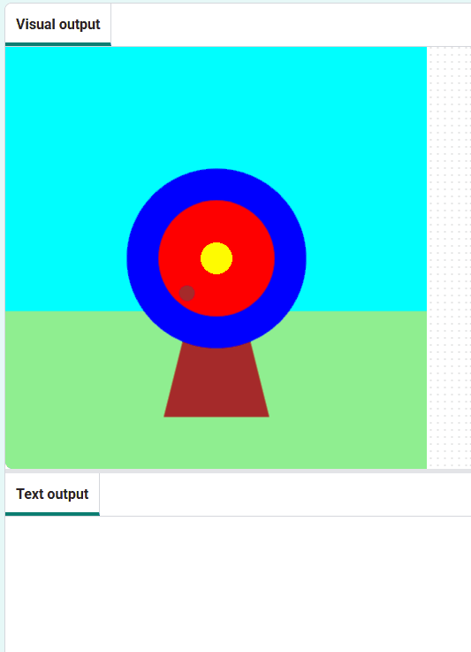
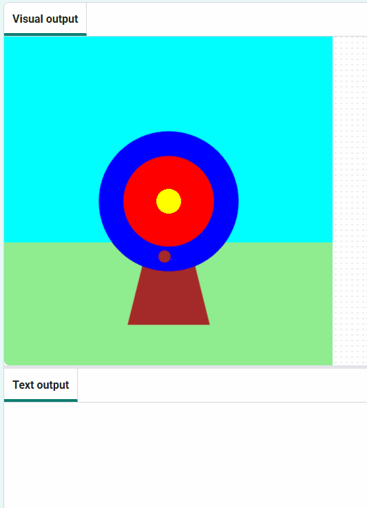

## Marquer des points

Ajoute un score en fonction de l'endroit où la flèche frappe.

{:width="300px"}

--- task ---

Commente la ligne pour imprimer le caractère 🎯 afin qu'il ne s'exécute plus.

--- code ---
---
language: python line_numbers: true line_number_start: 6
line_highlights: 7
---
def mouse_pressed(): # print('🎯')

--- /code ---

--- /task ---

--- task ---

Affiche un message **if** la `touche_couleur`{:.language-python} est égale à la couleur du cercle `extérieur` (bleu).

--- code ---
---
language: python line_numbers: true line_number_start: 6
line_highlights: 8-9
---
def mouse_pressed():    
# print('🎯') if hit_colour == Color('blue').hex: print('You hit the outer circle, 50 points!')

--- /code ---

**Astuce :** si tu as modifié la couleur de ton cercle extérieur, tu dois remplacer `blue` par le nom de la couleur que tu as choisie.

--- /task ---

--- task ---

**Test :** clique sur le bouton **Run** . Attends que la flèche atterrisse sur le cercle bleu, puis clique sur le bouton gauche de la souris. 

--- /task ---

`elif`{:.language-python} peut être utilisé pour ajouter plus de conditions à ton instruction `if`{:.language-python}.

--- task ---

Ajoute un peu de code pour marquer des points si la flèche tombe sur les cercles **intérieure** ou **milieu**.

--- code ---
---
language: python line_numbers: true line_number_start: 6
line_highlights: 10-14
---

def mouse_pressed(): # print('🎯') if hit_colour == Color('blue').hex: print('You hit the outer circle, 50 points!') elif hit_colour == Color('red').hex: print('You hit the inner circle, 200 points!') elif hit_colour == Color('yellow').hex: print('You hit the middle, 500 points!')

--- /code ---

--- /task ---

--- task ---

**Test :** clique sur le bouton **Run**. Tu devrais marquer des points chaque fois que tu atteins la cible.

--- /task ---

### Manquer la cible

Il te reste une décision à prendre : que se passe-t-il si la flèche n'atterrit sur aucun des cercles de la cible ?

Pour faire cette dernière vérification, tu utiliseras `else`{:.language-python}.

--- task ---

Ajoute du code pour `imprimer` un message lorsque aucune des déclarations `if` et `elif` n'est vraie.

--- code ---
---
language: python line_numbers: true line_number_start: 12
line_highlights: 14-15
---

    elif hit_colour == Color('yellow').hex:
        print('You hit the middle, 500 points!')
    else:   
        print('You missed! No points!')

--- /code ---

--- /task ---

--- task ---

**Test :** clique sur le bouton **Run** . Tire la flèche dans l'herbe ou dans le ciel pour voir le message qui te dit que tu as loupé la cible.

--- /task ---

--- save ---
