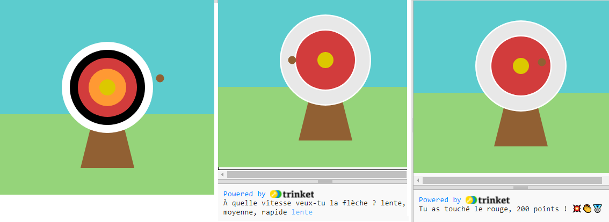

## Améliorer ton projet

Personnalise et ajoute plus à ton projet. Peut-être pourrais-tu changer le niveau de difficulté ou ajouter plus de cercles à ta cible.

{:width="300px"}

--- task ---

Tu pourrais :

+ Ajouter un `quatrième` et `cinquième` cercle, dans de nouvelles couleurs, qui marquent différents nombres de points en fonction de leur position 🟠🟣
+ Mettre des emojis dans tes messages imprimés ([voici une liste d'emojis](https://unicode.org/emoji/charts/full-emoji-list.html){:target="_blank"} que tu peux copier)
+ Rendre le jeu plus facile ou plus difficile en modifiant la valeur `frame_rate(2)` 💨
+ Utiliser `input()` pour demander à l'utilisateur à quel niveau de difficulté il veut jouer 🗣️

--- /task ---

--- collapse ---
---
title: Le projet terminé
---

Tu peux voir le [projet terminé ici](https://editor.raspberrypi.org/projects/target-practice-solution){:target="_blank"}.

--- /collapse ---
