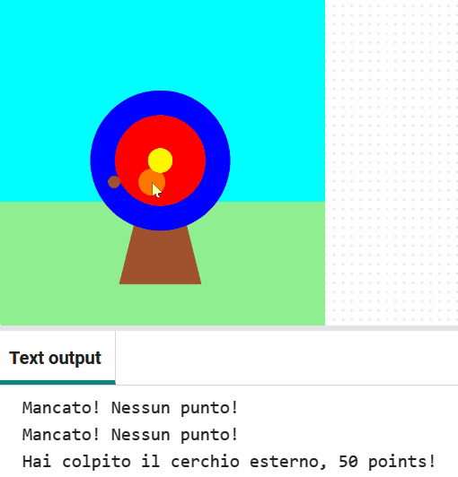
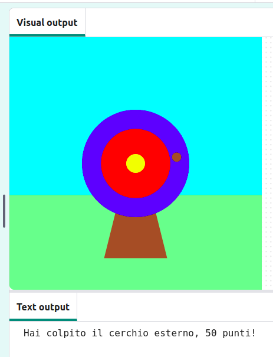
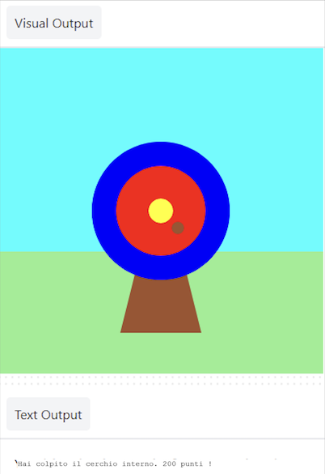

## Punteggio

Il tuo gioco aggiungerà punteggi in base a dove colpisce la freccia.

{:width="300px"}

Usiamo sempre le  condizioni per prendere decisioni. Potremmo dire "se la matita è spuntata, allora falle la punta". Allo stesso modo, le condizioni "if" ci permettono di scrivere codice che fa qualcosa di diverso a seconda che una condizione sia vera o falsa.

### Visualizza i punteggi

--- task ---

Elimina ❌ la riga di codice `print('🎯')` .

--- code ---
---
language: python
filename: main.py
line_numbers: true
line_number_start: 5
line_highlights: 7
---
# La funzione mouse_pressed va qui
def mouse_pressed():

--- /code ---

--- /task ---

--- task ---

Visualizza un messaggio **if** il `hit_color` è uguale al colore del cerchio `esterno` (blu) 🎯.

Nota 👀 che il codice utilizza due segni di uguale `==` per indicare **uguale a**.

--- code ---
---
language: python
filename: main.py - mouse_pressed()
line_numbers: true
line_number_start: 5
line_highlights: 7, 8
---

# La funzione mouse_pressed va qui
def mouse_pressed():     
    if hit_colour == Color('blue').hex:  # Come il codice delle funzioni, il codice delle istruzioni 'if' è rientrato
        print('Hai colpito il cerchio esterno, 50 punti!')

--- /code ---

**Suggerimento:** 💡 Se hai cambiato il colore del cerchio esterno, dovrai sostituire `'blu'` con il nome del colore che hai scelto.

--- /task ---

--- task ---

**Test:** 🔄 Esegui il tuo progetto. Prova a lanciare la freccia sul cerchio esterno blu per vedere il messaggio.

**Suggerimento:** 💡 `frame_rate=2`, in `run` in fondo al codice, controlla la velocità di disegno del tuo gioco. Se sta andando troppo veloce, impostalo su un numero inferiore.

{:width="600px"}

**Debug:** 🐞 Controlla di aver utilizzato l'ortografia americana di "Color" (senza "u") e che "Color" sia in maiuscolo.

**Debug:** 🐞 Assicurati che il tuo codice corrisponda esattamente e di aver rientrato il codice all'interno dell'istruzione `if` .

**Debug:** 🐞 Assicurati di aver inserito il nome corretto del colore che hai utilizzato per **il tuo** cerchio esterno.

--- /task ---

`elif` (else - if) può essere utilizzato per aggiungere più condizioni alla tua istruzione `if` . Questi verranno letti dall'alto verso il basso. Non appena viene trovata una condizione **True** , verrà eseguita. Eventuali condizioni rimanenti verranno ignorate.

--- task ---

Ottieni punti se la freccia si ferma sui cerchi `interni` o sui cerchi `centrali` 🎯:

--- code ---
---
language: python
filename: main.py - mouse_pressed()
line_numbers: true
line_number_start: 6
line_highlights: 9-12
---

def mouse_pressed():
    if hit_colour == Color('blue').hex:   
        print('Hai colpito il cerchio esterno, 50 punti!')
    elif hit_colour == Color('red').hex:
        print('Hai colpito il cerchio interno, 200 punti!')
    elif hit_colour == Color('yellow').hex:
        print('Hai colpito a metà bersaglio, 500 punti!')

--- /code ---

--- /task ---

--- task ---

**Test:** 🔄 Esegui il tuo progetto. Prova a lanciare la freccia sul cerchio interno e su quello esterno per vedere il messaggio.

{:width="600px"}

**Debug:** 🐞 Controlla che il tuo rientro corrisponda all'esempio.

**Debug:** 🐞Se vedi un messaggio `hit_colour` being 'not defined', torna indietro alla funzione `draw()` e controlla la riga che dichiara `hit_colour` come variabile globale.

**Debug:** 🐞 Assicurati di aver inserito il nome corretto del colore per **il tuo** cerchio esterno.

**Debug:** 🐞 Assicurati di aver utilizzato la stringa `.hex` per i colori del **tuo cerchio**.

--- /task ---

### Bersaglio mancato

C'è un'altra decisione che devi prendere: cosa succede se la freccia non si ferma su nessuno dei cerchi bersaglio? ❌

Per fare quest'ultimo controllo, usa `else`.

--- task ---

Aggiungi del codice per `stampare (print)` un messaggio `else` se nessuna della condizioni `if` e `elif` è stata soddisfatta.

--- code ---
---
language: python
filename: main.py
line_numbers: true
line_number_start: 6
line_highlights: 13-14
---

def mouse_pressed():
    if hit_colour == Color('blue').hex:   
        print('Hai colpito il cerchio esterno, 50 punti!')
    elif hit_colour == Color('red').hex:
        print('Hai colpito il cerchio interno, 200 punti!')
    elif hit_colour == Color('yellow').hex:
        print('Hai colpito a metà bersaglio, 500 punti!')
    else:   
        print('Mancato! Zero punti!')

--- /code ---

--- /task ---

--- task ---

**Test:** 🔄 Esegui il tuo progetto. Spara la freccia nell'erba o nel cielo per vedere il messaggio "mancato".

**Scegli:** 💭 Cambia il numero di punti segnati per i diversi colori.

--- /task ---

--- save ---
