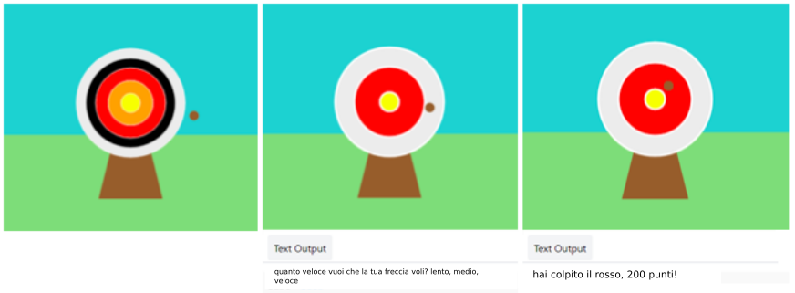

## Migliora il tuo progetto

Personalizza e aggiungi altro al tuo progetto. Forse potresti cambiare il livello di difficoltà o aggiungere più cerchi al tuo obiettivo.

{:width="300px"}

--- task ---

Potresti:

+ Aggiungere un `quarto` e `quinto` cerchio, in nuovi colori, che ottengono quantità diverse di punti in base alla loro posizione 🟠🟣
+ Inserisci emoji nei tuoi messaggi stampati ([ecco un elenco di emoji](https://unicode.org/emoji/charts/full-emoji-list.html){:target="_blank"} da cui puoi copiare) 🎯
+ Rendi il gioco più facile o più difficile modificando il valore `frame_rate=2`💨
+ Usa `input()` per chiedere all'utente a quale livello di difficoltà vuole giocare 🗣️

--- /task ---

--- collapse ---
---
title: Il progetto completo
---

Qui puoi visualizzare i [progetti completati](https://editor.raspberrypi.org/projects/target-practice-solution){:target="_blank"}.

--- /collapse ---
