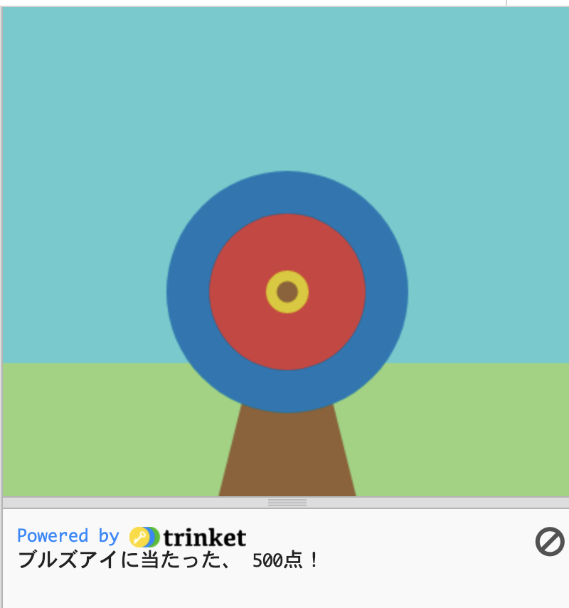

## はじめに

Pythonと`p5`グラフィックスライブラリを使って、ターゲットを描き、そこに矢を当てて得点を表示するゲームを作成します。

あなたは次のことを行います。
 + **RGBカラー**でゲームをカスタマイズする
 + **条件文**(`if`, `elif`, `else`) を使用して判断する
 + **x, y座標**で図形を配置する 

 RGBカラーは、R(ed)、G(reen)、B(lue) のそれぞれに対して0から255までの値を持ちます。 紫 の値は、R,G,B(128、0、128)で — 中程度の量の赤と青で、緑はありません。 ビデオゲームのアーティストやグラフィックデザイナーは、RGBカラーを使用しています。 

--- no-print ---

--- task ---

### 試してみる

  
下の**Run**ボタンをクリックするとゲームが開始されます。 ターゲットに点が表示されたら、マウスをクリック(タブレットではタップ) して矢を放ちます。 

数回行ってみてください。 スコアは的の下の出力エリアに表示されます。 矢印が異なる色に着弾したとき、スコアはどのように変化しますか？ 
  <iframe src="https://trinket.io/embed/python/3b053cd59a?outputOnly=true" width="600" height="560" frameborder="0" marginwidth="0" marginheight="0" allowfullscreen>
  </iframe>

--- /task ---

--- /no-print ---

--- print-only ---

--- /print-only ---

 アーチェリーの最も古い証拠は、南アフリカのクワズールナタールにある洞窟から来ています。 6万年から7万年前の石鏃（せきぞく）、骨鏃（こつぞく）の跡が見つかっています。 

