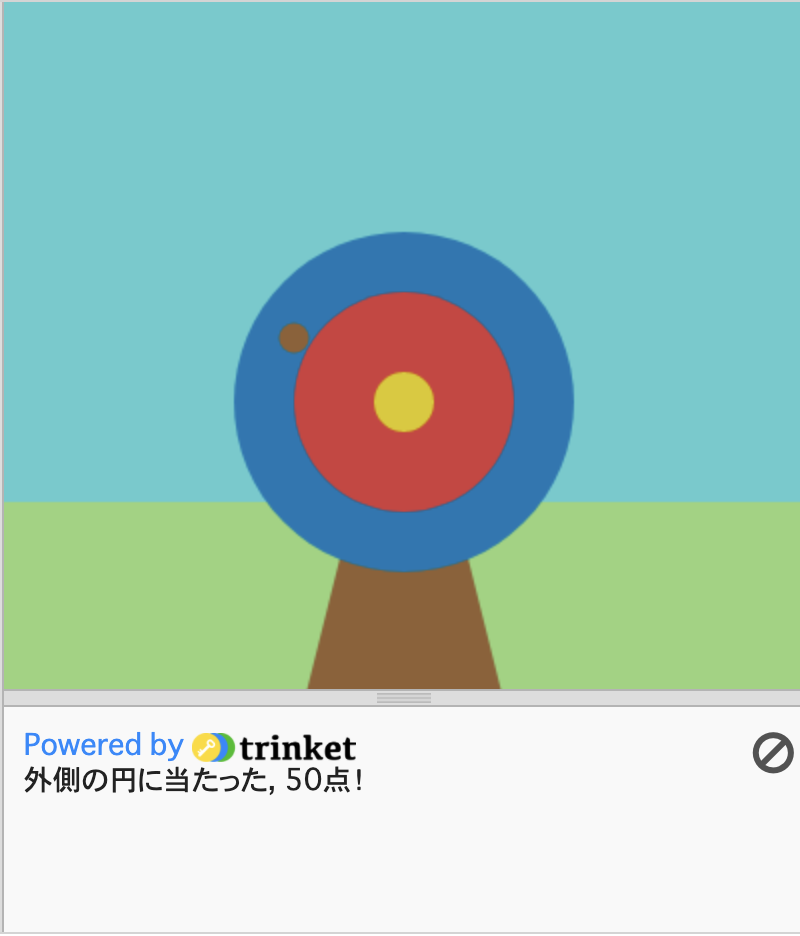

  <a class="c-survey-banner__link" href="https://form.raspberrypi.org/f/code-editor-feedback" target="_blank">Take our survey</a> to help make our Code Editor better!

## You will make

Pythonと`p5`グラフィックスライブラリを使って、ターゲットを描き、そこに矢を当てて得点を表示するゲームを作成します。

あなたは次のことを行います。
 + **RGBカラー**でゲームをカスタマイズする
 + **条件文**(`if`, `elif`, `else`) を使用して判断する
 + **x, y座標**で図形を配置する

--- no-print ---

### Play ▶️

--- task ---

  

下の**Run**ボタンをクリックするとゲームが開始されます。 ターゲットに点が表示されたら、マウスをクリック(タブレットではタップ) して矢を放ちます。 

数回行ってみてください。 スコアは的の下の出力エリアに表示されます。 矢印が異なる色に着弾したとき、スコアはどのように変化しますか？ 
  <iframe src="https://editor.raspberrypi.org/en/embed/viewer/target-practice-solution" width="400" height="710" frameborder="0" marginwidth="0" marginheight="0" allowfullscreen>
  </iframe>

**Tip:** 💡 When you press **Stop** you will see a prompt that says 'Execution interrupted'. This just means that you have stopped the program whilst the code was still running.

--- /task ---

--- /no-print ---

--- print-only ---

{:width="640px"}

--- /print-only ---

 アーチェリーの最も古い証拠は、南アフリカのクワズールナタールにある洞窟から来ています。 6万年から7万年前の石鏃（せきぞく）、骨鏃（こつぞく）の跡が見つかっています。 

