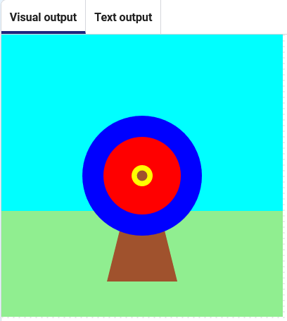

## 矢を放つ

Add an even smaller circle to represent an arrow.

{:width="300px"}

### Where will you shoot?

--- task ---

Add a function to draw a brown circle at coordinates `200`, `200`.

--- code ---
---
language: python filename: main.py - mouse_pressed() line_numbers: true line_number_start: 8
line_highlights: 11-12
---
# shoot_arrow関数はここにあります
def shoot_arrow():    
global hit_color #他の機能でも使用可能     
arrow_x = randint(100, 300)     
arrow_y = randint(100, 300)     
hit_color = get(arrow_x, arrow_y) #矢を描く前に色を保存する     
ellipse(arrow_x, arrow_y, 15, 15)

--- /code ---

--- /task ---

--- task ---

ターゲットを作成する `draw()`コードに移動して、`fill()`を `wood`に設定するコードを最後に追加し、新しい `shoot_arrow()` 関数を呼び出します。

--- code ---
---
language: python filename: main.py — draw() line_numbers: true line_number_start: 41
line_highlights: 44-45
---

    def shoot_arrow(): 
      ellipse(200, 200, 15, 15)

--- /code ---

--- /task ---

--- task ---

**テスト:**コードを実行し、矢がブルズアイに表示されることを確認します。 矢印はランダムな座標で再描画されます。

--- /task ---

矢印はランダムな座標で再描画されます。

--- task ---

`shoot_arrow()`関数に行き、`arrow_x`と`arrow_y`の2つの新しい変数を追加して、`100`から`300`までの乱数を格納します。

--- code ---
---
language: python filename: main.py line_numbers: true
line_highlights: 9-10
---
def shoot_arrow():    
arrow_x = randint(100, 300)    
arrow_y = randint(100, 300)    
hit_color = get(arrow_x, arrow_y) #矢印を描く前に色を保存する   
ellipse(arrow_x, arrow_y, 15, 15)

--- /code ---

--- /task ---

--- task ---

**Test:** Click the **Run** button. You should see the arrow jump around the target.

--- /task ---

--- save ---
