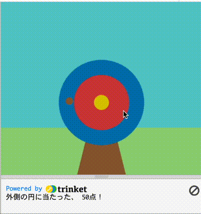
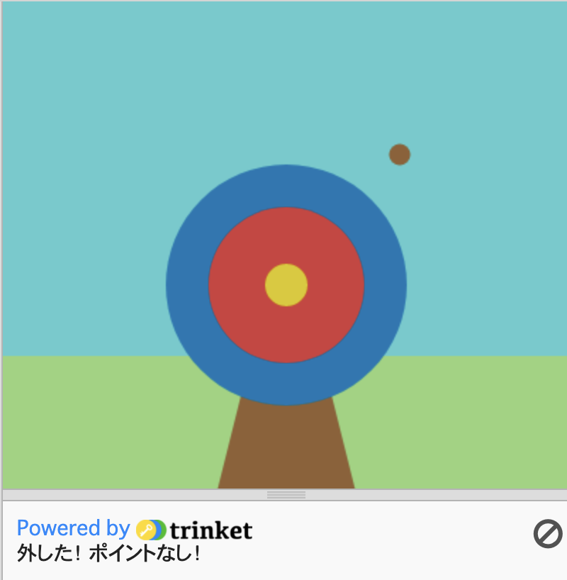

## 得点

<div style="display: flex; flex-wrap: wrap">
<div style="flex-basis: 200px; flex-grow: 1; margin-right: 15px;">
このステップでは、矢が当たった場所に応じてスコアを追加します。
</div>
<div>

{:width="300px"}

</div>
</div>

--- task ---

`draw()`関数内のカラー変数が、`mouse_pressed()`関数内のスコアチェックに使われます。 そのためには、グローバル変数として設定する必要があります。

--- code ---
---
language: python filename: main.py line_numbers: true line_number_start: 26
line_highlights: 28
---

def draw():
# すべてのフレームで行うこと
  global outer, inner, bullseye    
sky = color(92, 204, 206) #赤 = 92, 緑 = 204, 青 = 206    
grass = color(149, 212, 122)    
wood = color(145, 96, 51)    
outer = color(0, 120, 180)    
inner = color(210, 60, 60)   
bullseye = color(220, 200, 0)

--- /code ---

--- /task ---

<p style="border-left: solid; border-width:10px; border-color: #0faeb0; background-color: aliceblue; padding: 10px;">
私たちは常に<span style="color: #0faeb0; font-weight: bold;">条件</span>で判断しています。 「鉛筆の芯がとがっていなければ、削る」と言えます。 同様に、`if`条件では、ある条件が真か偽かによって異なる処理を行うコードを書くことができます。
</p>

--- task ---

ターゲットの外側の円に対してメッセージを`print`するには、`mouse_pressed()`関数に、`hit_color``==``outer`になっているかをチェックするコードを追加してください。

Pythonで`=`記号を使用する場合は、注意が必要です。
 + `=` は**代入<0>に使用されます - `arrow_x = 200`のように、変数の値を設定します。</li>
 + `==` は**同値**をテストするために使われます - `hit_color == bullseye` のように - もしどちらかの側のものが同じ値であれば、テストは`真`、そうでない場合`偽`になります。</ul>

`print()`のコードを変更して、点数を出すようにしてください。

--- code ---
---
language: python filename: main.py - mouse_pressed() line_numbers: true line_number_start: 8
line_highlights: 10-11
---

# mouse_pressed関数はここにあります
def mouse_pressed():     
if hit_color == outer:      
print('外側の円にあたった, 50点!') #関数と同様、'if'文はインデントされます。

--- /code ---

--- /task ---

--- task ---

**テスト：** プロジェクトを実行します。 あなたのメッセージを見るために青い外側の円の矢を止めてみてください。 矢の中心にあるピクセルの色が、保存されチェックされる色です。

**ヒント：** `setup()` 内の `frame_rate()` は、ゲームの描画速度を制御します。 速度が速すぎる場合は、小さい数値に設定してください。


**デバッグ：** コードが正確に一致し、`if`文の中でコードをインデントしていることを確認してください。 インデントはPythonに、条件が`True`のときだけコードを実行するように指示します。

--- /task ---

`inner`や`bullseye`にも矢が当たれば得点になるので、`outer`だけでなく、innerもチェックすべきサークルです。 これを行うには、 `elif` (else --ifの短縮バージョン) を使用します。

<p style="border-left: solid; border-width:10px; border-color: #0faeb0; background-color: aliceblue; padding: 10px;">
私たちは実生活の中で、<span style="color: #0faeb0; font-weight: bold;"> else - if </span> を使って意思決定をしています。 空の絵を描くときに、太陽用の黄色い絵の具があるかどうか確認します。 また、黄色の塗料がない場合は、オレンジ色を探します。 また、黄色やオレンジの絵の具がない場合は、赤を使うかもしれません。
</p>

--- task ---

`elif`は`if`文でのみ使用でき、`if`同様、条件をチェックします。 条件が`True`の場合、`elif`で何らかのコードが実行される。

`elif`の違いは、`if`とその前の`elif`の条件が`False`のときだけチェックする点です。

`inner`と`bullseye`に`elif`ステートメントを追加しました。

--- code ---
---
language: python filename: main.py - mouse_pressed() line_numbers: true line_number_start: 9
line_highlights: 12-15
---

def mouse_pressed():    
if hit_color == outer:    
print('外側の円に当たった、50点！')    
elif hit_color == inner:    
print('内側の円に当たった、 200点！')   
elif hit_color == bullseye:    
print('ブルズアイに当たった, 500点！')

--- /code ---

--- /task ---

--- task ---

**テスト：**プロジェクトを実行します。 赤と黄色の円に矢を止めて、そのメッセージを確認してください。


**デバッグ：** `elif`が`if`と同じインデントレベルであり、`elif`内のコードが`if`内のコードと同じレベルにあることを確認してください。

**Debug:** `inner` や `bullseye` が「定義されていない」というメッセージが表示されたら、 `draw()` に戻って、それらがグローバル変数を宣言している行にあるかどうかチェックしてみてください。

```python
global outer, inner, bullseye
```

--- /task ---

もうひとつ、「矢がどのターゲットサークルにも当たらなかった場合はどうするか」という判断が必要です。 この最後のチェックを行うために、`else`を使用するのです。

<p style="border-left: solid; border-width:10px; border-color: #0faeb0; background-color: aliceblue; padding: 10px;">
私たちは、<span style="color: #0faeb0; font-weight: bold;"> if ... else </span>で判断しているのです。 目が覚めたら、朝かどうか確認し、朝であれば起き、そうでなければまた寝る。 if...... else、という判断に思い当たることはありますか？ 
</p>

--- task ---

`else`内の`print`に`if`と`elif`のいずれの条件も満たされていない場合のメッセージを追加。

--- code ---
---
language: python filename: main.py line_numbers: true line_number_start: 9
line_highlights: 16-17
---

def mouse_pressed():    
if hit_color == outer:   
print('外側の円に当たった、50点！')   
elif hit_color == inner:   
print('内側の円に当たった、 200点！')   
elif hit_color == bullseye:    
print('ブルズアイに当たった, 500点！')   
else:   
print('外した！ ポイントなし！')

--- /code ---

--- /task ---

--- task ---

**テスト：**プロジェクトを実行します。 草むらや空に矢を止めてみて、ミスメッセージを見ることができます。 お好みで色ごとの得点数を変えてみてください。



--- /task ---

--- save ---
