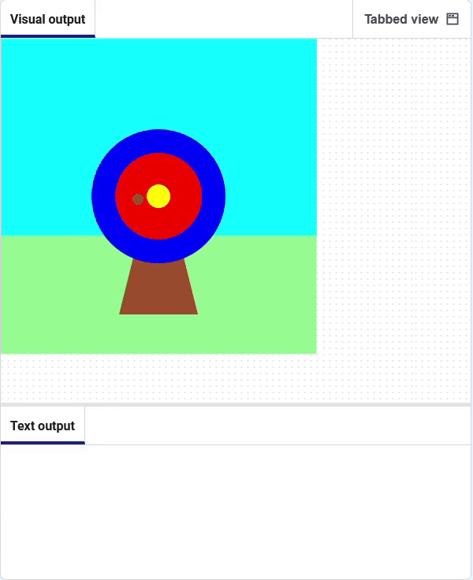

## What colour did you hit?

Next, you will add some code to get the colour at the location of the arrow.

### Get the colour hit by the arrow

--- task ---

は**代入**に使用されます - `arrow_x = 200`のように、変数の値を設定します。

Add code to `get` the colour at the centre of the arrow ,and store it in the `hit_colour` variable.

--- code ---
---
language: python filename: main.py line_numbers: true line_number_start: 9
line_highlights: 28
---
def mouse_pressed():    
if hit_color == outer:   
print('外側の円に当たった、50点！ ')   
elif hit_color == inner:   
print('内側の円に当たった、 200点！

--- /code ---

**テスト：** プロジェクトを実行します。 あなたのメッセージを見るために青い外側の円の矢を止めてみてください。 矢の中心にあるピクセルの色が、保存されチェックされる色です。

--- /task ---

--- task ---

**テスト：**プロジェクトを実行します。 赤と黄色の円に矢を止めて、そのメッセージを確認してください。

--- /task ---

### Run code when the mouse is pressed

--- task ---

Comment out the line that prints the colour. This means it will not run.

--- code ---
---
language: python filename: main.py line_numbers: true line_number_start: 26
line_highlights: 10-11
---

    def mouse_pressed(): 
      if hit_color == outer: 
        print('外側の円にあたった, 50点!')

--- /code ---

--- /task ---

--- task ---

Add code to print the target emoji 🎯 **when the mouse is clicked**.

--- code ---
---
language: python filename: main.py - mouse_pressed() line_numbers: true line_number_start: 8
line_highlights: 12-15
---
# The mouse_pressed function goes here
def mouse_pressed():    
print('🎯')

--- /code ---

--- /task ---

--- task ---

**テスト：**プロジェクトを実行します。 赤と黄色の円に矢を止めて、そのメッセージを確認してください。 You should see the 🎯 character printed when you click the mouse on the target.

--- /task ---

--- save ---