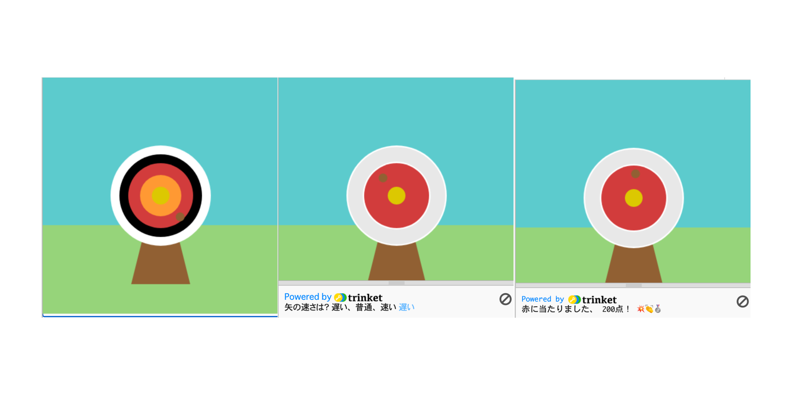

## プロジェクトをアップグレードする

自分なりのコードをプロジェクトに追加しましょう。 難易度を変えたり、ターゲットになる円を増やしたりできるかもしれません。

{:width="300px"}

--- task ---

こんなことができます:

+ `4番目`と`5番目`の円を新色で追加し、その位置によって異なる点数を獲得できるようにする。
+ メッセージに絵文字を入れる([絵文字の一覧はこちら](https://unicode.org/emoji/charts/full-emoji-list.html){:target="_blank"}からコピーできます。
+ `frame_rate(2)` の値を変更することで、ゲームを簡単にしたり難しくしたりすることができます。
+ `input()`を使用して、ユーザーにどの難易度でプレイしたいかを尋ねる。

--- /task ---

--- collapse ---
---
title: 完成したプロジェクト
---

[完成したプロジェクトはこちら](https://trinket.io/python/3b053cd59a){:target="_blank"}で確認できます。

--- /collapse ---
