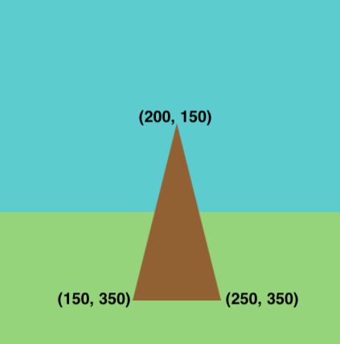

## Teken je doelwit

De standaard van het doelwit is een driehoekige vorm. Het doelwit is gemaakt met gekleurde cirkels - kleinere cirkels zijn meer punten waard dan grotere. 

{:width="300px"}

Vormen worden getekend in de volgorde waarin de coderegels lopen. De driehoekige houten standaard staat deels achter de doelcirkels en moet dus als eerste worden getekend.

Stel je voor dat je alle vormen uit papier knipt. Afhankelijk van hoe je dat papier rangschikt en overlapt, kan het eindresultaat er heel anders uitzien.

### Teken de standaard

--- task ---

Wanneer je de functie `triangle()` oproept, moet je drie sets coördinaten opgeven, `x1, y1, x2, y2, x3, y3` die ieder de positie van een van de hoeken van de driehoek aangeven.

--- collapse ---
---
title: Driehoekscoördinaten
---

  Hier zijn drie voorbeelddriehoeken, elk met verschillende sets coördinaten. Kijk naar de rasterpositie van elk om te zien hoe de `x` en `y` coördinaten de hoeken van de driehoeken positioneren:
  + Groene driehoek: triangle(50, 50, 150, 50, 180, 100)
  + Blauwe driehoek: triangle(210, 280, 300, 350, 380, 100)
  + Bruine driehoek: triangle(50, 150, 200, 250, 180, 350)

  

--- /collapse ---

Teken een `triangle()` voor de standaard met hoeken op (150, 350), (200, 150) en (250, 350).

--- code ---
---
language: python 
filename: main.py - draw() 
line_numbers: true 
line_number_start: 28
line_highlights: 31-32
---

  fill(gras)   
  rect(0, 250, 400, 150) #x, y, breedte, hoogte

  fill(hout) #Stel de vulkleur van de standaard in op bruin     
  triangle(150, 350, 200, 150, 250, 350)

--- /code ---

**Tip:** We hebben opmerkingen aan onze code toegevoegd, zoals `#Stel de vulkleur van de standaard in op bruin`, om je te vertellen wat deze code doet. Je hoeft deze opmerkingen niet aan je code toe te voegen, maar ze kunnen nuttig zijn om je eraan te herinneren wat coderegels doen.

--- /task ---

--- task ---

**Test:** Voer je code uit om de standaard voor je doelwit te zien.

--- /task ---

### Teken je doelwit

--- task ---

Het grootste deel van het doelwit zal een blauwe **cirkel** zijn, gemaakt met behulp van de functie `ellipse()`. Een ellips is een vorm met één zijde en geen hoeken. Het kan platgedrukt worden, zoals een ovaal, of perfect rond, zoals een cirkel.

Een ellips heeft `x` en `y` coördinaten, breedte en hoogte nodig. De `x` en `y` coördinaten van een ellips geven de middenpositie aan.

De blauwe cirkel zal de bruine cirkel bedekken waar ze elkaar overlappen, omdat die cirkel later is getekend.

**Tip:** Om een cirkel te maken, moeten de **breedte** en **hoogte** gelijk zijn.

--- code ---
---
language: python 
filename: main.py - draw() 
line_numbers: true 
line_number_start: 31
line_highlights: 33-34
---

  fill(hout)   
  triangle(150, 350, 200, 150, 250, 350)   
  fill(buitenste)    
  ellipse(200, 200, 170, 170) #Buitenste cirkel. 200, 200 is het midden van het scherm

--- /code ---

--- /task ---

--- task ---

**Test:** Voer je code uit om de eerste grote blauwe cirkel te zien.

--- /task ---

--- task ---

Maak twee nieuwe variabelen om de kleuren voor de resterende `binnenste` en `roos` cirkels op te slaan.

Wijs kleuren toe aan de `binnenste` en `roos` variabelen met `color()`.

De functie `color()` verwacht drie getallen: één voor rood, groen en blauw.

We gebruikten cijfers die traditionele boogschietkleuren geven, maar je kunt alle kleuren gebruiken die je wilt, zolang ze maar van elkaar verschillen.

[[[generic-theory-simple-colours]]]

--- code ---
---
language: python 
filename: main.py - draw() 
line_numbers: true 
line_number_start: 18
line_highlights: 24-25
---

def draw():   
  #Dingen om te doen in elk frame

  lucht = color(92, 204, 206)   
  gras = color(149, 212, 122)   
  hout = color(145, 96, 51)   
  buitenste = color(0, 120, 180) #Blauw    
  binnenste = color(210, 60, 60) # Rood    
  roos = color(220, 200, 0) # Geel

--- /code ---

--- /task ---

--- task ---

Het doel is gemaakt van cirkels van verschillende grootte met dezelfde centrale coördinaten (200, 200) - het midden van het scherm.

Voeg nog twee cirkels toe om een binnenste cirkel en de roos weer te geven. Wijzig de `fill()` voordat je elke cirkel tekent.

--- code ---
---
language: python 
filename: main.py - draw() 
line_numbers: true 
line_number_start: 33
line_highlights: 37-40
---

  fill(hout)    
  triangle(150, 350, 200, 150, 250, 350) #Standaard    
  fill(buitenste)   
  ellipse(200, 200, 170, 170) #Buitenste cirkel   
  fill(binnenste)   
  ellipse(200, 200, 110, 110) #Binnenste cirkel   
  fill(roos)   
  ellipse(200, 200, 30, 30) #Roos

--- /code ---

--- /task ---

--- task ---

**Test:** Voer je project opnieuw uit om het doel met drie gekleurde cirkels te zien. Verander de kleuren totdat je er tevreden mee bent.

**Debuggen:** Python gebruikt de Amerikaanse spelling van 'color' (zonder een 'u'), dus zorg ervoor dat jij dat ook doet.

--- /task ---

--- save ---

