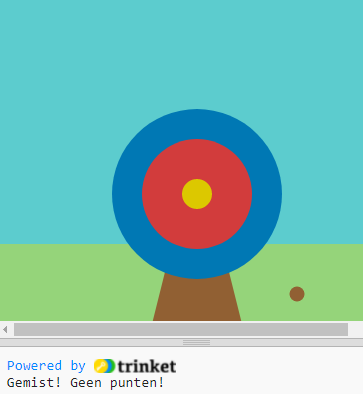

## Punten scoren

In deze stap voeg je scores toe afhankelijk van waar de pijl raakt.

{:width="300px"}

--- task ---

Go to the `draw()` function and add `, outer, inner, middle` to the list of global variables.

--- code ---
---
language: python filename: main.py line_numbers: true line_number_start: 26
line_highlights: 28
---

def draw():
# Dingen om te doen in elk frame
  global buitenste, binnenste, roos    
lucht = color(92, 204, 206) #Rood = 92, Groen = 204, Blauw = 206    
gras = color(149, 212, 122)    
hout = color(145, 96, 51)    
buitenste = color(0, 120, 180)    
binnenste = color(210, 60, 60)   
roos = color(220, 200, 0)

--- /code ---

--- /task ---

We gebruiken de hele tijd  voorwaarden om beslissingen te nemen. We zouden kunnen zeggen 'als het potlood bot is, slijp het dan'. Evenzo laten `if`-voorwaarden ons code schrijven die iets anders doet, afhankelijk van of een voorwaarde waar of onwaar is.

### Display the scores

--- task ---

Delete ❌ the `print( red(hit_color), green(hit_color), blue(hit_color) )` line of code.

--- code ---
---
def mouse_pressed():     
if raak_kleur == buitenste:      
print('Je raakt de buitenste cirkel, 50 punten!') #Net als functions zijn 'if'-instructies ingesprongen
line_highlights: 10-11
---
# De muis_ingedrukt functie komt hier
def mouse_pressed():

--- /code ---

--- /task ---

--- task ---

`print` a message `if` the `hit_color` is equal to `outer` 🎯.

wordt gebruikt om **gelijkheid** te testen — zoals `raak_kleur == roos` — als beide kanten dezelfde waarde hebben, dan is de test `True` (Waar), anders is het `False` (Niet waar)

--- code ---
---
language: python filename: main.py - mouse_pressed() line_numbers: true line_number_start: 9
line_highlights: 12-15
---

# The mouse_pressed function goes here
def mouse_pressed():     
if hit_color == outer:      
print('You hit the outer circle, 50 points!') # Like functions, 'if' statements are indented

--- /code ---

--- /task ---

--- task ---

**Test:** Voer je project uit. Probeer de pijl op de rode en gele cirkels te laten landen om hun berichten te zien.

**Tip:** `frame_rate()`, in `setup()`, bepaalt hoe snel je spel gaat. Als het te snel gaat, stel het dan in op een lager getal.

**Debuggen:** Zorg ervoor dat `elif` zich op hetzelfde inspringniveau bevindt als je `if`, en dat de code in je `elif` zich op hetzelfde niveau bevindt als de code in je `if`.

--- /task ---

Een `elif` kan alleen gebruikt worden met een `if` statement en, net als een `if`, controleert het een voorwaarde. Als de voorwaarde `Waar`is, voert de `elif` wat code uit. These will be read from top to bottom. As soon as a **True** condition is found, it will be actioned. The remaining conditions will be ignored.

--- task ---

Aangezien er punten worden gescoord als de pijl ook op de `binnenste` of `roos` cirkels terechtkomt, is `buitenste` niet de enige cirkel die je moet controleren. Gebruik hiervoor `elif` (een verkorte versie van else - if).

--- code ---
---
language: python filename: main.py - mouse_pressed() line_numbers: true line_number_start: 8
line_highlights: 16-17
---

def mouse_pressed():    
if raakt_kleur == buitenste:    
print('Je raakt de buitenste cirkel, 50 punten!')    
elif raak_kleur == binnenste:    
print('Je raakt de binnenste cirkel, 200 punten!')   
elif raak_kleur == roos:    
print('Je raakt de roos, 500 punten!')

--- /code ---

--- /task ---

--- task ---

**Test:** Voer je project uit. Try to stop the arrow on the inner and middle circles to see their messages.

**Debuggen:** Zorg ervoor dat je code exact overeenkomt en dat de code in je `if`-statement is ingesprongen.

**Debuggen:** Als je een bericht ziet over `binnenste` of `roos` die 'niet gedefinieerd' zijn, ga dan terug naar `draw()` en controleer of ze als globale variabele declareert zijn.

--- /task ---

### Missing the target

Er is nog een beslissing die je moet nemen: wat gebeurt er als de pijl niet op een van de doelcirkels landt? ❌

Om deze laatste controle uit te voeren, gebruik je `else`.

--- task ---

Voeg code toe om een bericht `te tonen` `als` aan geen van de `if` en `elif` voorwaarden is voldaan.

--- code ---
---
language: python filename: main.py line_numbers: true line_number_start: 9
line_highlights: 15, 16
---

def mouse_pressed():    
if raak_kleur == buitenste:   
print('Je raakt de buitenste cirkel, 50 punten!')   
elif raak_kleur == binnenste:   
print('Je raakt de binnenste cirkel, 200 punten!')   
elif raak_kleur == roos:    
print('Je hebt de roos, 500 punten!')   
else:   
print('Je hebt gemist! Geen punten!')

--- /code ---

--- /task ---

--- task ---

**Test:** Voer je project uit. Probeer de pijl in het gras of de lucht te laten landen om het bericht 'Gemist' te zien.

**Choose:** 💭 Change the number of points scored for the different colours if you like.

--- /task ---

