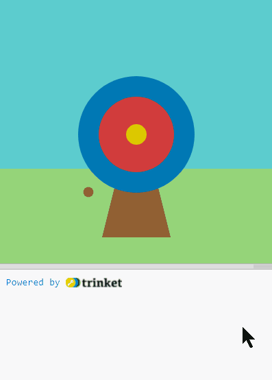
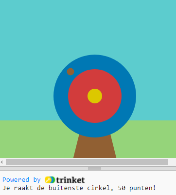
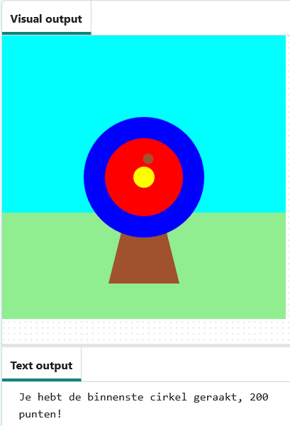

## Punten scoren

In deze stap voeg je scores toe afhankelijk van waar de pijl raakt.

{:width="300px"}

We gebruiken  if ... else om beslissingen te nemen. We could say 'if the pencil is blunt, then sharpen it'. Similarly, `if` conditions let us write code that do something different depending on whether a condition is true or false.

### Display the scores

--- task ---

Delete ❌ the `print('🎯')` line of code.

--- code ---
---
language: python filename: main.py line_numbers: true line_number_start: 9
line_highlights: 28
---
# The mouse_pressed function goes here
def draw():

--- /code ---

--- /task ---

We gebruiken de hele tijd  voorwaarden om beslissingen te nemen. We zouden kunnen zeggen 'als het potlood bot is, slijp het dan'. Evenzo laten `if`-voorwaarden ons code schrijven die iets anders doet, afhankelijk van of een voorwaarde waar of onwaar is.

--- task ---

Om een bericht voor de buitenste cirkel van het doel `weer te geven`, voeg je code toe aan je `mouse_pressed()` functie om te controleren of de `raak_kleur` `==` is aan de `buitenste`.

Wees voorzichtig bij het gebruik van het `=` symbool in Python:

--- code ---
---
language: python filename: main.py - mouse_pressed() line_numbers: true line_number_start: 8
line_highlights: 10-11
---

# De muis_ingedrukt functie komt hier
def mouse_pressed():     
if raak_kleur == buitenste:      
print('Je raakt de buitenste cirkel, 50 punten!') #Net als functions zijn 'if'-instructies ingesprongen

--- /code ---

**Tip:** 💡 If you changed the colour of your outer circle then you will need to replace `'blue'` with the colour name that you have chosen.

--- /task ---

--- task ---

**Test:** Voer je project uit. Probeer de pijl op de rode en gele cirkels te laten landen om hun berichten te zien.

**Tip:** `frame_rate()`, in `setup()`, bepaalt hoe snel je spel gaat. Als het te snel gaat, stel het dan in op een lager getal.

wordt gebruikt om **gelijkheid** te testen — zoals `raak_kleur == roos` — als beide kanten dezelfde waarde hebben, dan is de test `True` (Waar), anders is het `False` (Niet waar)

**Debuggen:** Zorg ervoor dat `elif` zich op hetzelfde inspringniveau bevindt als je `if`, en dat de code in je `elif` zich op hetzelfde niveau bevindt als de code in je `if`.

def mouse_pressed():    
if raakt_kleur == buitenste:    
print('Je raakt de buitenste cirkel, 50 punten!')    
elif raak_kleur == binnenste:    
print('Je raakt de binnenste cirkel, 200 punten!')   
elif raak_kleur == roos:    
print('Je raakt de roos, 500 punten!')

--- /task ---

Een `elif` kan alleen gebruikt worden met een `if` statement en, net als een `if`, controleert het een voorwaarde. Als de voorwaarde `Waar`is, voert de `elif` wat code uit. These will be read from top to bottom. As soon as a **True** condition is found, it will be actioned. Any remaining conditions will be ignored.

--- task ---

Aangezien er punten worden gescoord als de pijl ook op de `binnenste` of `roos` cirkels terechtkomt, is `buitenste` niet de enige cirkel die je moet controleren. Gebruik hiervoor `elif` (een verkorte versie van else - if).

--- code ---
---
language: python filename: main.py - mouse_pressed() line_numbers: true line_number_start: 9
line_highlights: 12-15
---

def mouse_pressed(): if hit_colour == Color('blue').hex:   
print('You hit the outer circle, 50 points!') elif hit_colour == Color('red').hex: print('You hit the inner circle, 200 points!') elif hit_colour == Color('yellow').hex: print('You hit the middle, 500 points!')

--- /code ---

--- /task ---

--- task ---

**Test:** Voer je project uit. Try to fire the arrow on the inner and middle circles to see their messages.

**Debuggen:** Zorg ervoor dat je code exact overeenkomt en dat de code in je `if`-statement is ingesprongen.

**Debuggen:** Als je een bericht ziet over `binnenste` of `roos` die 'niet gedefinieerd' zijn, ga dan terug naar `draw()` en controleer of ze als globale variabele declareert zijn.

**Debug:** 🐞 Make sure that you have entered the correct colour name for **your** circles.

wordt gebruikt voor een **toewijzing** — zoals `pijl_x = 200` om de waarde van een variabele in te stellen

--- /task ---

### Missing the target

Er is nog een beslissing die je moet nemen: wat gebeurt er als de pijl niet op een van de doelcirkels landt? ❌

Om deze laatste controle uit te voeren, gebruik je `else`.

--- task ---

Voeg code toe om een bericht `te tonen` `als` aan geen van de `if` en `elif` voorwaarden is voldaan.

--- code ---
---
language: python filename: main.py line_numbers: true line_number_start: 26
line_highlights: 16-17
---

def mouse_pressed(): if hit_colour == Color('blue').hex:   
print('You hit the outer circle, 50 points!') elif hit_colour == Color('red').hex: print('You hit the inner circle, 200 points!') elif hit_colour == Color('yellow').hex: print('You hit the middle, 500 points!') else:   
print('You missed! Geen punten!')

--- /code ---

--- /task ---

--- task ---

**Test:** Voer je project uit. Probeer de pijl in het gras of de lucht te laten landen om het bericht 'Gemist' te zien.

**Choose:** 💭 Change the number of points scored for the different colours.

--- /task ---

--- save ---
