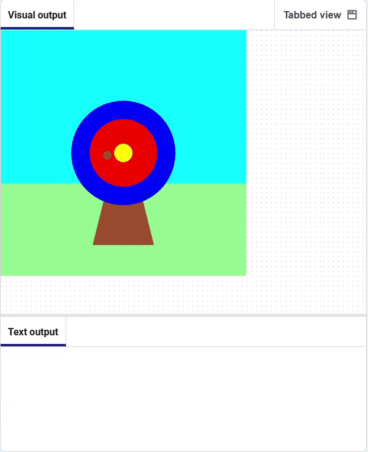

## Welke kleur heb je geraakt?

Vervolgens voeg je wat code toe om de kleur op de plek van de pijl op te halen.

### Haal de kleur op die door de pijl wordt geraakt

--- task ---

**Debuggen:** 🐞 Als je een bericht ziet over `raak_kleur` die 'niet gedefinieerd' is, ga dan terug naar `draw()` en controleer de regel waarin `raak_kleur` als globale variabele gedeclareerd is.

Voeg code toe om de kleur in het midden van de pijl `op te halen` en sla deze op in de variabele `raak_kleur` .

--- code ---
---
language: python line_numbers: true line_number_start: 9
line_highlights: 10, 13, 14
---
def shoot_arrow(): global hit_colour  
arrow_x = randint(100, 300)  
arrow_y = randint(100, 300) hit_colour = get(arrow_x, arrow_y).hex print(hit_colour) fill('brown') circle(arrow_x, arrow_y, 15)

--- /code ---

**Debug:** 🐞 Zorg ervoor dat je de `.hex` string hebt gebruikt voor **jouw** cirkelkleuren.

--- /task ---

--- task ---

**Test:** 🔄 Voer je project uit. **Debuggen:** 🐞 Zorg ervoor dat je de juiste kleurnaam hebt ingevoerd voor **jouw** cirkels.

--- /task ---

### Code uitvoeren wanneer de muis wordt ingedrukt

--- task ---

Maak een comment van de regel die de kleur print. Dit betekent dat het niet zal werken.

--- code ---
---
language: python line_numbers: true line_number_start: 13
line_highlights: 14
---

    hit_colour = get(arrow_x, arrow_y).hex
    # print(hit_colour)
    circle(arrow_x, arrow_y, 15)

--- /code ---

--- /task ---

--- task ---

Voeg code toe om de doel-emoji 🎯 af te drukken ** wanneer met de muis wordt geklikt**.

--- code ---
---
language: python line_numbers: true line_number_start: 5
line_highlights: 6-7
---
# De mouse_pressed functie komt hier
def mouse_pressed():    
print('🎯')

--- /code ---

--- /task ---

--- task ---

**Test:** 🔄 Voer je project uit. Wanneer je met de muis op het doel klikt, zou je het teken 🎯 moeten zien.

--- /task ---

--- save ---