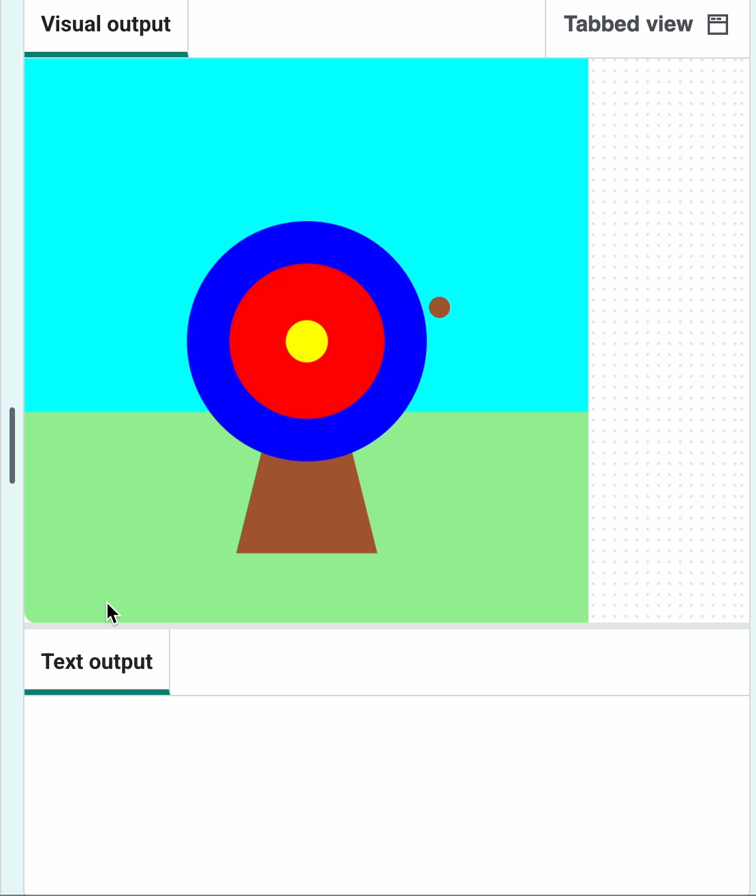
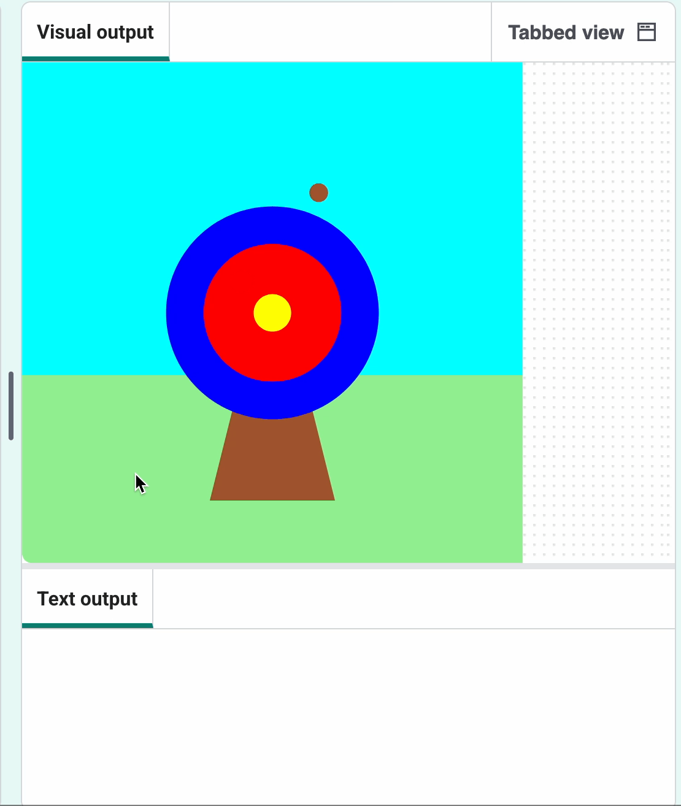

## Punten scoren

Afhankelijk van waar de pijl terechtkomt, wordt er een score toegekend.

{:width="300px"}

--- task ---

Maak een comment van de regel die het teken 🎯 print, zodat deze niet meer wordt uitgevoerd.

--- code ---
---
language: python line_numbers: true line_number_start: 6
line_highlights: 7
---
def mouse_pressed(): # print('🎯')

--- /code ---

--- /task ---

--- task ---

Geef een bericht weer **als** de `raak_kleur`{:.language-python} gelijk is aan de `buitenste` cirkelkleur (blauw).

--- code ---
---
language: python line_numbers: true line_number_start: 6
line_highlights: 8-9
---
def mouse_pressed():    
# print('🎯') if hit_colour == Color('blue').hex: print('You hit the outer circle, 50 points!')

--- /code ---

**Tip:** Als je de kleur van je buitenste cirkel hebt gewijzigd, moet je `'blue'` vervangen door de kleurnaam die je hebt gekozen.

--- /task ---

--- task ---

**Test:** Klik op de knop **Run**. Wacht tot de pijl in de blauwe cirkel terechtkomt en klik vervolgens op de linkermuisknop. 

--- /task ---

`elif`{:.language-python} kan worden gebruikt om meer voorwaarden toe te voegen aan je `if`{:.language-python} statement.

--- task ---

Voeg wat meer code toe om punten te scoren als de pijl op de **binnenste** of **middelste** cirkel terechtkomt.

--- code ---
---
language: python line_numbers: true line_number_start: 6
line_highlights: 10-14
---

def mouse_pressed(): # print('🎯') if hit_colour == Color('blue').hex: print('You hit the outer circle, 50 points!') elif hit_colour == Color('red').hex: print('You hit the inner circle, 200 points!') elif hit_colour == Color('yellow').hex: print('You hit the middle, 500 points!')

--- /code ---

--- /task ---

--- task ---

**Test:** Klik op de knop **Run**. Je zou punten moeten scoren wanneer je het doel raakt.

--- /task ---

### Het doel missen

Er is nog een beslissing die je moet nemen: wat gebeurt er als de pijl niet op een van de doelcirkels landt?

Om deze laatste controle uit te voeren, gebruikt je `else`{:.language-python}.

--- task ---

Voeg code toe aan het `print` commando om een een bericht weer te geven wanneer geen van de `if` en `elif` statements waar zijn.

--- code ---
---
language: python line_numbers: true line_number_start: 12
line_highlights: 14-15
---

    elif hit_colour == Color('yellow').hex:
        print('You hit the middle, 500 points!')
    else:   
        print('You missed! No points!')

--- /code ---

--- /task ---

--- task ---

**Test:** Klik op de knop **Run**. Probeer de pijl in het gras of de lucht te laten landen om het gemist bericht te zien.

--- /task ---

--- save ---
