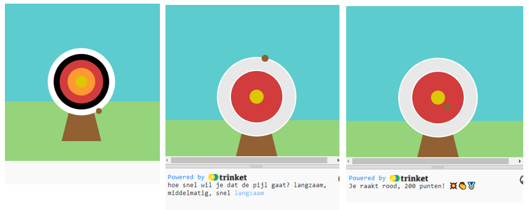

## Verbeter je project

Nu is het jouw beurt! Wat kun jij nog meer toevoegen aan je project?  Misschien kun je de moeilijkheidsgraad aanpassen of meer cirkels aan je doel toevoegen.

{:width="300px"}

--- task ---

Je kunt:

+ Een `vierde` en `vijfde` cirkel toevoegen, in nieuwe kleuren, die verschillende punten scoren op basis van hun positie 🟠🟣
+ Emoji in je gedrukte berichten zetten ([hier is een lijst met emoji](https://unicode.org/emoji/charts/full-emoji-list.html){:target="_blank"} waaruit je kunt kopiëren) 🎯
+ Het spel gemakkelijker of moeilijker maken door de waarde van `frame_rate=2` te wijzigen 💨
+ `input()` gebruiken om de gebruiker te vragen op welk moeilijkheidsniveau ze willen spelen 🗣️

--- /task ---

--- collapse ---
---
title: Voltooid project
---

Je kunt het [voltooide project hier](https://editor.raspberrypi.org/nl-NL/projects/target-practice-solution){:target="_blank"} bekijken.

--- /collapse ---
