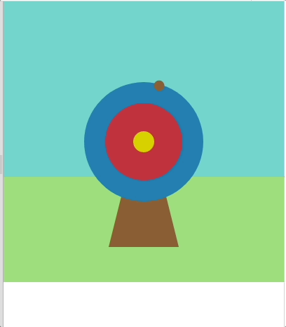
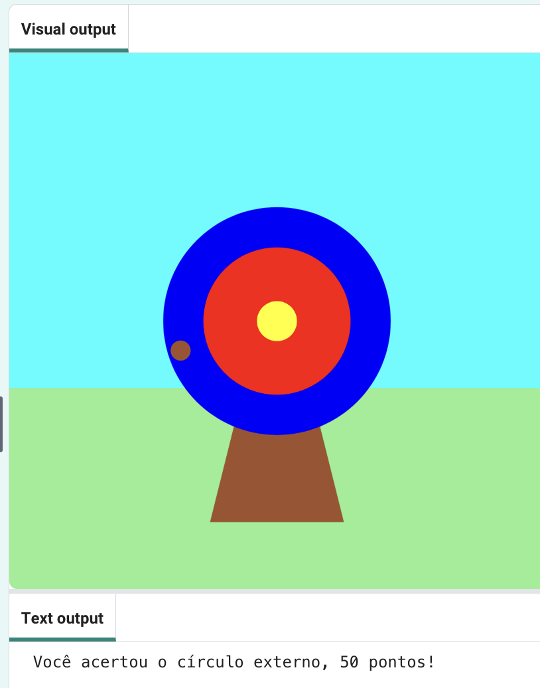
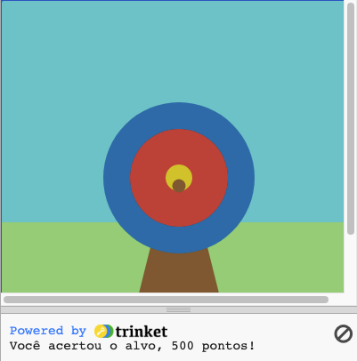

## Marque pontos

Seu jogo adicionará pontuações com base em onde a flecha acerta.

{:width="300px"}

Usamos  condições o tempo todo para tomar decisões. Poderíamos dizer 'se o lápis está cego, aponte-o'. Da mesma forma, as condições `if` nos permitem escrever código que faz algo diferente dependendo se uma condição é verdadeira ou falsa.

### Exiba as pontuações

--- task ---

Exclua ❌ a linha de código `print('🎯')`.

--- code ---
---
language: python filename: main.py line_numbers: true line_number_start: 5
line_highlights: 7
---
# A função mouse_pressed vai aqui
def mouse_pressed():

--- /code ---

--- /task ---

--- task ---

Exiba uma mensagem **if** a `cor_acerto` for igual à cor dos `círculos` externos (azul) 🎯.

Observe 👀 que o código usa dois sinais de igual `==` para significar **igual a**.

--- code ---
---
language: python filename: main.py - mouse_pressed() line_numbers: true line_number_start: 5
line_highlights: 7, 8
---

# A função mouse_pressed vai aqui
def mouse_pressed():     
if hit_colour == Color('blue').hex:  # Like the code in functions, the code in 'if' statements is indented print('You hit the outer circle, 50 points!')

--- /code ---

**Dica:** 💡 Se você mudou a cor do seu círculo externo, você precisará substituir `'blue'` pelo nome da cor que você escolheu.

--- /task ---

--- task ---

**Teste:** 🔄 Execute seu projeto. Tente parar a flecha no círculo externo azul para ver sua mensagem.

**Dica:** 💡 `frame_rate=2`, em `run` na parte inferior do seu código, controla a rapidez com que seu jogo desenha. Se estiver indo muito rápido, defina-o para um número menor.

**Depurar:** 🐞 Verifique se você usou a grafia americana de 'Color' (sem 'u') e se 'Color' está em maiúscula.

**Depurar:** 🐞 Certifique-se de que seu código corresponda exatamente e de que você recuou o código dentro de sua instrução `if`.

**Depurar:** 🐞 Certifique-se de ter inserido o nome correto da cor utilizada para **seu** círculo externo.

--- /task ---

`elif` (else - if) pode ser usado para adicionar mais condições à sua instrução `if`. Eles serão lidos de cima para baixo. Assim que uma condição verdadeira **True** for encontrada, ela será acionada. As condições restantes serão ignoradas.

--- task ---

Marque pontos se a flecha atingir os círculos `interno` ou do `meio` 🎯:

--- code ---
---
language: python filename: main.py - mouse_pressed() line_numbers: true line_number_start: 6
line_highlights: 9-12
---

def mouse_pressed(): if hit_colour == Color('blue').hex:   
print('You hit the outer circle, 50 points!') elif hit_colour == Color('red').hex: print('You hit the inner circle, 200 points!') elif hit_colour == Color('yellow').hex: print('You hit the middle, 500 points!')

--- /code ---

--- /task ---

--- task ---

**Teste:** 🔄 Execute seu projeto. Tente disparar a flecha nos círculos interno e do meio para ver suas mensagens.

**Depurar:** 🐞 Verifique se seu recuo corresponde ao exemplo.

**Depurar:** 🐞 Se você vir uma mensagem sobre `cor_acerto` como 'não definido', volte para `draw()` e verifique se a linha declara `cor_acerto` como uma variável global.

**Depurar:** 🐞 Certifique-se de ter inserido o nome correto da cor para **seus** círculos.

**Depurar:** 🐞 Certifique-se de ter usado `.hex` para as cores dos **seus** círculos.

--- /task ---

### Errando o alvo

Há mais uma decisão que você precisa tomar: o que acontece se a flecha não atingir nenhum dos círculos alvo? ❌

Para fazer esta última verificação, você usa o `else`.

--- task ---

Adicione código para imprimir `print` uma mensagem `else` caso nenhuma das condições `if` e `elif` forem atendidas.

--- code ---
---
language: python filename: main.py line_numbers: true line_number_start: 6
line_highlights: 13-14
---

def mouse_pressed(): if hit_colour == Color('blue').hex:   
print('You hit the outer circle, 50 points!') elif hit_colour == Color('red').hex: print('You hit the inner circle, 200 points!') elif hit_colour == Color('yellow').hex: print('You hit the middle, 500 points!') else:   
print('You missed! No points!')

--- /code ---

--- /task ---

--- task ---

**Teste:** 🔄 Execute seu projeto. Dispare a flecha na grama ou no céu para ver a mensagem de erro.

**Escolha:** 💭 Altere o número de pontos marcados para as diferentes cores.

--- /task ---

--- save ---
